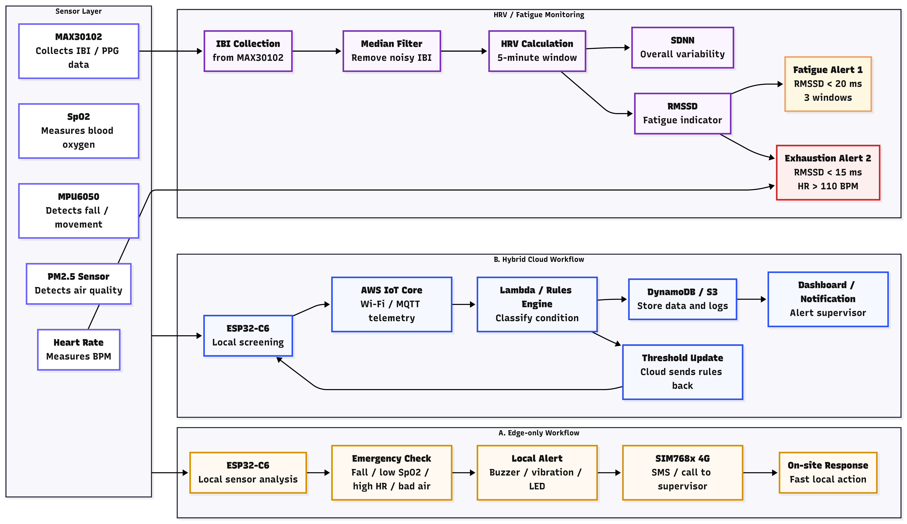
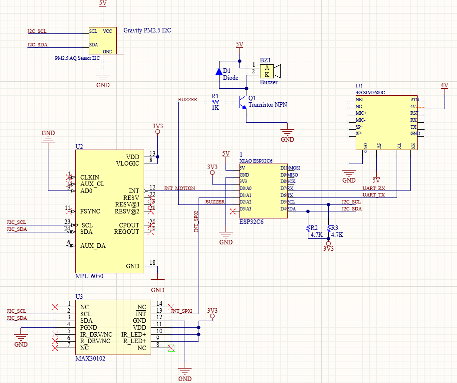

# FOURUT Worker Health and Safety Monitoring System

FOURUT is an edge-cloud worker safety monitoring prototype designed to detect early health risks, fall events, fatigue conditions, and unsafe air-quality exposure in construction or industrial working environments. The system combines wearable sensing, local edge decision-making, ESP-NOW environmental communication, AWS IoT cloud ingestion, backend classification, data storage, and supervisor alerting.

This repository is organized as a complete academic engineering artifact. It includes firmware, hardware documentation, cloud configuration, Lambda processing logic, test events, architecture documents, phase summaries, and validation screenshots.

---

## Demo and Presentation

The following materials can be attached when submitting or presenting the project:

| Material | Link |
|---|---|
| Demo video | [Google Drive demo video](https://drive.google.com/file/d/1NAvh9XB_X3LWpM4N3eT3Hwkft42uvORd/view) |
| Presentation slides | [PPT presentation](https://www.canva.com/design/DAHKrIPIE9A/TO-aPsEb0Ita-kzXmD70YA/edit) |
| Round 1 report | [`docs/reports/round1_concept_design.pdf`](docs/reports/round1_concept_design.pdf) |
| Round 2 report | [`docs/reports/round2_prototype.pdf`](docs/reports/round2_prototype.pdf) |

> Replace the two placeholder links above with the final Google Drive video link and presentation link before submission.

---

## Project Overview

The project addresses the problem of worker safety monitoring in environments where fatigue, falls, oxygen-related abnormalities, and particulate-matter exposure may occur. FOURUT uses an edge-first architecture: urgent safety decisions are made locally on the ESP32 gateway, while the cloud layer is responsible for centralized logging, validation, and notification.

The system monitors four groups of indicators:

| Monitoring Area | Main Data | Purpose |
|---|---|---|
| Biometric condition | Heart rate, SpO2, IBI, HRV indicators | Detect oxygen drop, abnormal heart rate, and fatigue risk |
| Motion condition | Acceleration, gyroscope, SVM, posture change | Detect possible fall events |
| Environmental condition | PM1.0, PM2.5, PM10, AQI | Detect unsafe air-quality exposure |
| Alert state | Edge alarm level, fall flag, risk category | Communicate urgent worker-safety events |

The prototype is not a certified medical or industrial safety device. It is an academic proof-of-concept that demonstrates an integrated sensing, edge-processing, cloud-logging, and alerting workflow.



---

## End-to-End Architecture


The complete workflow is:

```text
Worker and environment
        ↓
MAX30102, MPU6050, APM10 PM sensor
        ↓
ESP32 edge gateway and ESP-NOW environmental node
        ↓
Local risk assessment and buzzer alarm
        ↓
MQTT over TLS through AWS IoT Core
        ↓
AWS Lambda processing
        ↓
DynamoDB record, S3 historical log, SNS email alert
```

The edge device does not wait for the cloud before triggering urgent local alarms. This design reduces response latency and keeps the most safety-critical decision close to the worker.

---

## System Components

| Layer | Component | Role |
|---|---|---|
| Wearable edge layer | XIAO ESP32-C3 / ESP32-class gateway | Runs FreeRTOS tasks, reads sensors, performs local risk logic, publishes MQTT payloads |
| Biometric sensing | MAX30102 | Measures heart rate, SpO2, and inter-beat interval data |
| Motion sensing | MPU6050 | Provides acceleration and gyroscope data for fall detection |
| Local alarm | Buzzer and cancel button | Alerts the worker and allows acknowledgement for lower-level alarms |
| Environmental node | ESP32S NodeMCU / ESP32 DevKit + APM10 | Reads particulate-matter data and sends packets by ESP-NOW |
| Cloud ingestion | AWS IoT Core | Receives MQTT telemetry, HRV summaries, and alert events |
| Backend processing | AWS Lambda | Normalizes payloads and classifies worker risk level |
| Storage | DynamoDB and S3 | Stores processed records and historical logs |
| Notification | SNS | Sends email alerts for serious or emergency states |



---

## Repository Structure

```text
FOURUT_Worker_Health_Safety_Monitoring/
├── cloud/
│   ├── aws_iot/                 # AWS IoT policy, rule, and cloud workflow documentation
│   └── lambda/                  # Lambda processor and backend documentation
├── docs/
│   ├── architecture/            # System architecture, communication, and power-management docs
│   ├── figures/                 # General project figures
│   └── reports/                 # Academic report PDFs
├── firmware/
│   ├── edge_gateway_esp32_two_directions/
│   │   └── FOURUT_firmware_two_directions/
│   │       ├── option_A_single_file/  # Compact demonstration firmware
│   │       └── option_B_modular/      # Modular firmware for maintainability
│   ├── environmental_node_espnow/     # ESP32 + APM10 ESP-NOW node
│   └── micropython_prototype/         # Early MicroPython prototype
├── hardware/
│   ├── hardware_design.md       # Hardware design explanation
│   └── schematics/              # Circuit/schematic image
├── phases/                      # Phase 1, Phase 2, and Phase 3 summaries
├── results/                     # Demo screenshots and validation evidence
├── tests/                       # Lambda test events and expected behavior
├── LICENSE
└── README.md
```

---

## Main Workflows

### 1. Communication Workflow


The system uses two communication levels:

| Link | Protocol | Purpose |
|---|---|---|
| Environmental node → edge gateway | ESP-NOW | Sends PM1.0, PM2.5, PM10, AQI, sequence number, and node status |
| Edge gateway → AWS IoT Core | MQTT over TLS | Sends telemetry, HRV summaries, and alert events |
| AWS IoT Core → Lambda | IoT Rule | Triggers cloud-side processing |
| Lambda → DynamoDB/S3/SNS | AWS SDK | Stores records and sends supervisor notifications |

### 2. Edge Algorithm Pipeline


The gateway evaluates multiple risk sources:

| Risk Type | Main Logic |
|---|---|
| SpO2 risk | Warning below 90%, critical below 80% |
| Heart-rate risk | Bradycardia below 50 BPM, tachycardia above 120 BPM |
| Fatigue risk | RMSSD below 20 ms for repeated windows; severe exhaustion when RMSSD is below 15 ms and BPM is above 110 |
| Fall risk | Free-fall phase, impact phase, posture change, and stillness confirmation |
| Environmental risk | AQI warning above 75 and danger above 150 |

Fall detection is intentionally multi-stage to reduce false alarms. A fall is confirmed only when the motion sequence satisfies free-fall, impact, posture-change, and inactivity/stillness conditions within the configured timing window.

### 3. Cloud Processing Workflow


The Lambda worker receives telemetry or alert payloads and converts them into a standardized risk state:

| Level | State | Meaning | Notification |
|---:|---|---|---|
| 0 | `NORMAL` | No abnormal condition detected | No |
| 1 | `WARNING` | Early abnormal signal requiring monitoring | Optional / deployment-specific |
| 2 | `DANGER` | Serious condition requiring supervisor attention | Yes |
| 3 | `EMERGENCY` | Critical condition requiring immediate response | Yes |

Processed events are saved for traceability. Email notifications are used only for serious or critical events in the validation tests.

---

## Firmware Overview

### Edge Gateway Firmware

Path:

```text
firmware/edge_gateway_esp32_two_directions/FOURUT_firmware_two_directions/
```

This firmware runs the wearable edge gateway. It performs sensor acquisition, fall detection, fatigue estimation, local alarm control, ESP-NOW environmental reception, and MQTT publishing.

Two equivalent implementation directions are included:

| Option | Path | Best Use |
|---|---|---|
| Option A: Single-file firmware | `option_A_single_file/fourut_edge_freertos_aws.ino` | Presentation, walkthrough, quick debugging |
| Option B: Modular firmware | `option_B_modular/` | Clean repository submission, extension, maintainability |

Both versions follow the same system behavior. Option A is easier to explain during a live demo, while Option B is better for long-term development because the code is separated into modules such as sensors, fall detection, HRV, alerts, MQTT, ESP-NOW, and FreeRTOS tasks.

Default MQTT topics:

```text
worker/W001/telemetry
worker/W001/hrv
worker/W001/alert
```

Default edge timing and threshold examples:

| Parameter | Value |
|---|---:|
| MPU6050 read interval | 20 ms |
| MAX30102 read interval | 1000 ms |
| Cloud publish interval | 5000 ms |
| Alert cooldown | 30000 ms |
| Free-fall threshold | 4.9 m/s² |
| Impact threshold | 29.4 m/s² |
| Posture-change threshold | 35° |
| Fall latch duration | 30000 ms |

### Environmental Node Firmware

Path:

```text
firmware/environmental_node_espnow/
```

This firmware runs on an ESP32S NodeMCU or ESP32 DevKit connected to an APM10 particulate-matter sensor. It reads PM1.0, PM2.5, and PM10 values, calculates a prototype PM2.5-based AQI, and sends an `EnvPacket` to the gateway through ESP-NOW.

Key configuration values are located near the top of:

```text
firmware/environmental_node_espnow/esp32_apm10_espnow_node.ino
```

Before uploading, verify:

```cpp
#define ESPNOW_WIFI_CHANNEL 13
#define USE_BROADCAST false
uint8_t GATEWAY_MAC[6] = { ... };
#define PM_RX_PIN 16
#define PM_TX_PIN 17
#define PM_BAUD 1200
```

The ESP-NOW Wi-Fi channel and gateway MAC address must match the gateway Serial Monitor output.

---

## Cloud Backend Overview

### AWS IoT Core

Path:

```text
cloud/aws_iot/
```

This folder documents the AWS IoT configuration, including the IoT policy, topic structure, and rule-based forwarding workflow. The gateway publishes JSON payloads to AWS IoT Core through MQTT over TLS.

### Lambda Processor

Path:

```text
cloud/lambda/
```

The Lambda function:

1. normalizes incoming payloads;
2. extracts worker, biometric, environmental, and alarm fields;
3. classifies the condition into `NORMAL`, `WARNING`, `DANGER`, or `EMERGENCY`;
4. stores processed results in DynamoDB and S3;
5. sends SNS email notifications for serious or emergency states.

Required Lambda environment variables:

```text
DDB_TABLE_NAME
S3_BUCKET_NAME
SNS_TOPIC_ARN
```

---

## Quick Start

### 1. Prepare the Edge Gateway

Open one of the gateway firmware options:

```text
firmware/edge_gateway_esp32_two_directions/FOURUT_firmware_two_directions/option_A_single_file/
```

or:

```text
firmware/edge_gateway_esp32_two_directions/FOURUT_firmware_two_directions/option_B_modular/
```

Copy the example secrets file:

```text
secrets.example.h → secrets.h
```

Then fill in local Wi-Fi and AWS IoT credentials:

```cpp
#define WIFI_SSID "YOUR_WIFI_SSID"
#define WIFI_PASSWORD "YOUR_WIFI_PASSWORD"
#define AWS_IOT_ENDPOINT "your-endpoint-ats.iot.your-region.amazonaws.com"
```

Also paste the AWS Root CA, device certificate, and private key into `secrets.h`.

### 2. Install Required Arduino Libraries

Install the required libraries in Arduino IDE or PlatformIO:

```text
DFRobot_BloodOxygen_S
Adafruit_MPU6050
Adafruit_Sensor
WiFi
esp_now
WiFiClientSecure
PubSubClient
ArduinoJson
```

### 3. Upload the Gateway Firmware

Upload either the single-file or modular gateway firmware. Open the Serial Monitor and confirm:

```text
Sensor initialization
Wi-Fi connection
AWS IoT MQTT connection
Gateway MAC address
Wi-Fi channel
Telemetry publishing
```

Use the printed MAC address and Wi-Fi channel to configure the environmental node.

### 4. Prepare the Environmental Node

Open:

```text
firmware/environmental_node_espnow/esp32_apm10_espnow_node.ino
```

Set the ESP-NOW channel and gateway MAC address. Then upload the firmware to the ESP32 environmental node. The Serial Monitor should show APM10 readings and ESP-NOW send status.

### 5. Validate the Cloud Workflow

Use the test events in:

```text
tests/lambda_events/
```

The expected scenarios are:

| Test File | Scenario | Expected State |
|---|---|---|
| `Test_Normal.json` | Stable worker condition | `NORMAL` |
| `Test_Danger.json` | Low SpO2 / high-risk condition | `DANGER` |
| `Test_Emergency_Fall.json` | Confirmed fall event | `EMERGENCY` |
| `Test_Exhaustion.json` | Severe fatigue condition | `EMERGENCY` |

Validation screenshots are stored in:

```text
results/demo_screenshots/
```

They include MQTT reception, Lambda tests, DynamoDB records, S3 logs, IoT Rule configuration, and SNS email notification evidence.

---

## Documentation Guide

For a complete understanding of the project, read the documentation in this order:

| Order | File | Purpose |
|---:|---|---|
| 1 | [`docs/architecture/system_architecture.md`](docs/architecture/system_architecture.md) | Complete system model and layer explanation |
| 2 | [`docs/architecture/architecture_explanation.md`](docs/architecture/architecture_explanation.md) | Design rationale and edge-cloud decision logic |
| 3 | [`docs/architecture/communication_workflow.md`](docs/architecture/communication_workflow.md) | ESP-NOW, MQTT, AWS IoT, Lambda, storage, and alert flow |
| 4 | [`docs/architecture/power_management.md`](docs/architecture/power_management.md) | Power domains, state machine, and power-planning strategy |
| 5 | [`hardware/hardware_design.md`](hardware/hardware_design.md) | Hardware design and sensor interface explanation |
| 6 | [`tests/test_event_descriptions.md`](tests/test_event_descriptions.md) | Lambda validation cases and expected outputs |

---

## Phase Development Summary

| Phase | Focus | Main Outcome |
|---|---|---|
| Phase 1 | Concept design and architecture | Defined worker-safety problem, system layers, communication model, and risk states |
| Phase 2 | Functional prototype and AWS workflow | Built an initial edge-cloud prototype with cloud classification, storage, and alerting |
| Phase 3 | Final integration and environmental extension | Added FreeRTOS gateway structure, ESP-NOW environmental node, PM/AQI data, and full validation evidence |

Detailed phase summaries are available in:

```text
phases/phase1_summary.md
phases/phase2_summary.md
phases/phase3_summary.md
```

---

## Validation Evidence

The repository includes evidence for the major prototype functions:

| Evidence | Location |
|---|---|
| MQTT message received by AWS IoT Core | `results/demo_screenshots/mqtt_test_client_message.png` |
| Lambda normal test success | `results/demo_screenshots/lambda_test_normal_success.png` |
| Lambda danger email test | `results/demo_screenshots/lambda_test_danger_email_sent.png` |
| DynamoDB saved item | `results/demo_screenshots/dynamodb_saved_item.png` |
| S3 saved log | `results/demo_screenshots/s3_saved_log.png` |
| SNS email alert | `results/demo_screenshots/sns_email_alert.png` |
| IoT Rule SQL | `results/demo_screenshots/iot_rule_sql.png` |

These files support the claim that the prototype can transmit data, process it in the cloud, store results, and send supervisor notifications.

---

## Security Notes

Do not commit real credentials or private account information. The following files and values should remain local only:

```text
secrets.h
.env
*.pem
*.key
*.crt
AWS private keys
Wi-Fi password
AWS IoT endpoint if private
SNS topic ARN if sensitive
personal email addresses
```

Use `secrets.example.h` and placeholder values for public documentation.

---

## Current Limitations

The current repository represents a working academic prototype, but several limitations remain:

| Limitation | Explanation |
|---|---|
| Rule-based classification | The system is interpretable but not adaptive to individual worker profiles |
| Prototype AQI calculation | The AQI method should be aligned with the target deployment standard in future work |
| ESP-NOW encryption not enabled | Local environmental packets are not yet encrypted |
| Limited battery telemetry | Environmental node battery reporting is not fully implemented |
| Multi-worker scaling not generalized | Worker IDs, MQTT topics, and thresholds are currently configured for prototype use |
| Not certified for medical/safety deployment | The system should not be used as a certified medical or industrial safety device |

---

## Future Work

Recommended next improvements include:

1. add configurable worker profiles and adaptive thresholds;
2. enable ESP-NOW peer encryption;
3. improve battery measurement and runtime estimation;
4. add dashboard visualization for supervisors;
5. support multiple workers and multiple environmental nodes;
6. strengthen payload schema validation before cloud processing;
7. evaluate false positives and detection latency using repeated physical tests;
8. improve enclosure design for wearable stability and sensor contact quality.

---

## License

This project is distributed under the license included in [`LICENSE`](LICENSE).

---

## Repository Status

This repository is intended for academic demonstration, project assessment, and future engineering development. It combines embedded firmware, wireless communication, cloud processing, validation evidence, and presentation materials into a single worker health and safety monitoring system.
