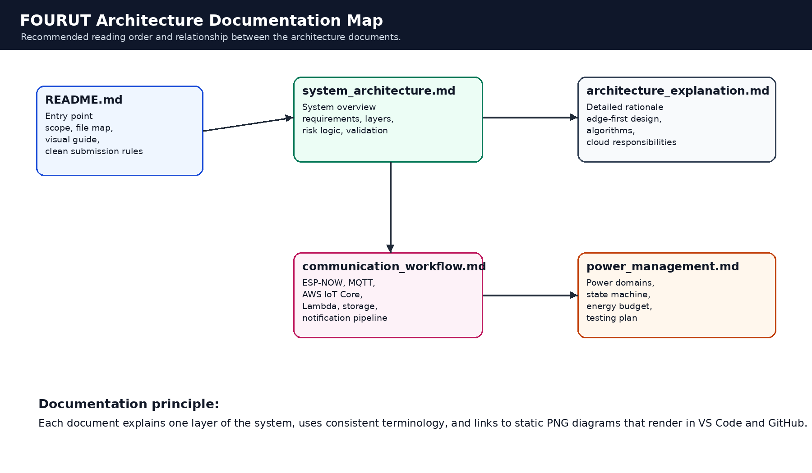
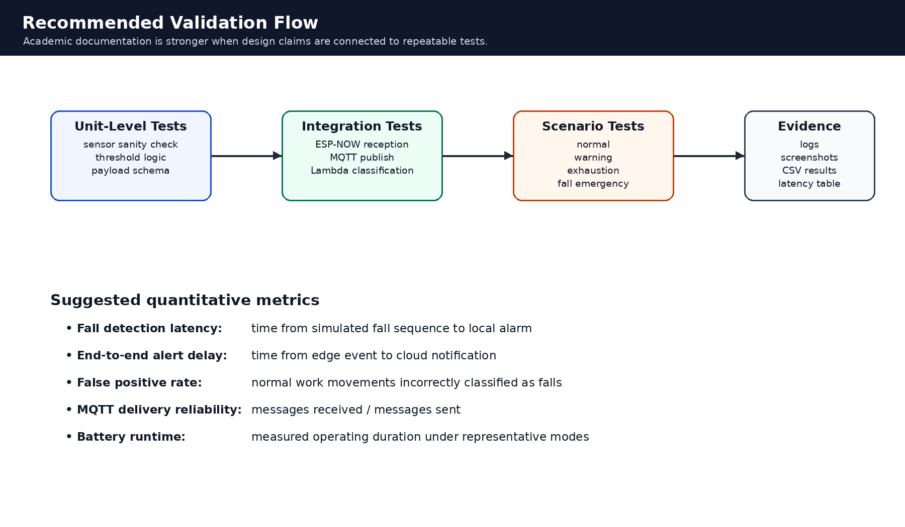

# FOURUT Architecture Documentation

## Purpose

This folder documents the architecture of the FOURUT Worker Health and Safety Monitoring System. The documentation is written for academic review, engineering continuation, and final repository submission. It explains the system from the top-level design down to communication, edge-side algorithms, cloud workflow, and power-management strategy.

The documentation uses static PNG diagrams instead of only Mermaid diagrams. This makes the visuals easier to view in VS Code, GitHub, and PDF exports without requiring a Mermaid extension.



---

## Recommended Reading Order

| Order | File | Purpose |
|---:|---|---|
| 1 | `system_architecture.md` | Introduces the complete wearable monitoring system, layers, operating modes, and risk-detection logic. |
| 2 | `architecture_explanation.md` | Explains the architectural rationale, edge-first safety model, algorithmic flow, cloud responsibilities, and limitations. |
| 3 | `communication_workflow.md` | Documents ESP-NOW, MQTT, AWS IoT Core, Lambda, storage, and notification workflows. |
| 4 | `power_management.md` | Describes power domains, power-state transitions, communication duty cycling, energy budgeting, and test plans. |

---

## Documentation Scope

The architecture is organized around four engineering concerns:

1. **Worker safety monitoring** through biometric, motion, and environmental sensing.
2. **Edge-first decision-making** so urgent alarms do not depend on cloud latency.
3. **Hybrid communication** through local ESP-NOW, MQTT over Wi-Fi, and an optional cellular emergency path.
4. **Energy-aware wearable operation** through duty cycling, interrupt-driven wake-up, and selective activation of high-current modules.

The implementation may be presented in two levels:

| Level | Description |
|---|---|
| Current prototype | ESP32 edge gateway, MAX30102, MPU6050, environmental node, ESP-NOW, Wi-Fi MQTT, AWS IoT backend, Lambda classification, storage, and notification workflow. |
| Deployment extension | SIM768x or equivalent cellular module for emergency SMS/voice-call fallback, stronger battery management, and field-ready enclosure integration. |

This distinction prevents the documentation from overclaiming unimplemented hardware while still preserving the full intended system design.

---

## Visual Assets

Static diagrams are stored in:

```text
docs/architecture/assets/
```

| Diagram | File |
|---|---|
| Documentation map | `assets/docs_map.png` |
| Layered system model | `assets/system_layers.png` |
| End-to-end architecture | `assets/end_to_end_architecture.png` |
| Edge algorithm pipeline | `assets/edge_algorithm_pipeline.png` |
| Communication workflow | `assets/communication_workflow.png` |
| MQTT topic separation | `assets/mqtt_topic_separation.png` |
| Power domains | `assets/power_domains.png` |
| Power-state machine | `assets/power_state_machine.png` |
| Validation flow | `assets/validation_flow.png` |

---

## Repository Cleanliness Guidelines

Keep this folder focused on final documentation. Avoid including temporary or local-only files.

```text
keep:
  README.md
  system_architecture.md
  architecture_explanation.md
  communication_workflow.md
  power_management.md
  assets/

remove:
  draft notes that are not referenced
  duplicate diagrams with unclear names
  screenshots without captions
  local secrets
  build artifacts
  Mermaid-only diagrams if static previews are required
```

Recommended image naming convention:

```text
assets/<topic>_<purpose>.png
```

Examples:

```text
assets/system_layers.png
assets/communication_workflow.png
assets/power_state_machine.png
```

---

## Academic Writing Guidelines

The architecture documents should use precise and verifiable language.

Recommended style:

- distinguish between implemented prototype features and future deployment extensions;
- explain why each design decision was made;
- connect thresholds and workflows to validation tests;
- avoid unsupported claims such as clinical accuracy or certified safety compliance;
- describe limitations explicitly;
- keep credentials and private endpoints outside the repository.

Avoid phrases that imply the system is already a certified medical or industrial safety device. The appropriate description is a prototype or research-oriented worker safety monitoring system.

---

## Security Note

The documentation should never include real Wi-Fi credentials, AWS IoT endpoints, device certificates, private keys, supervisor phone numbers, or private email addresses. Use example placeholders only.

Recommended root `.gitignore` entries:

```gitignore
secrets.h
**/secrets.h
.env
*.pem
*.key
*.crt
config.py
__pycache__/
.pio/
build/
*.bin
*.elf
*.map
.DS_Store
```

---

## Validation Expectations

A strong final report should connect the architecture to measurable evidence.

Suggested evidence:

| Evidence Type | Example |
|---|---|
| Serial logs | Sensor initialization, task startup, fall-detection state transitions |
| MQTT logs | Telemetry, HRV, and alert payloads received by AWS IoT Core |
| Lambda tests | `normal`, `danger`, `exhaustion`, and `emergency_fall` event classification |
| Storage proof | DynamoDB item and S3 event-log screenshot |
| Notification proof | SNS or email notification example |
| Quantitative table | fall latency, MQTT delay, alert delay, packet loss, runtime estimate |



---

## Summary

This documentation folder presents FOURUT as a hybrid edge-cloud wearable safety-monitoring architecture. The clean documentation flow is:

```text
system overview
  -> architectural rationale
  -> communication workflow
  -> power-management strategy
  -> validation evidence
```

This structure supports both academic assessment and future engineering development.
