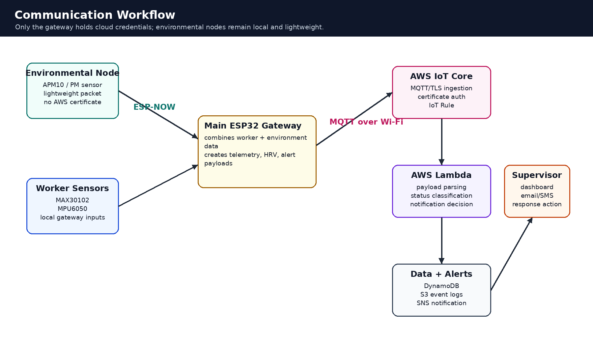
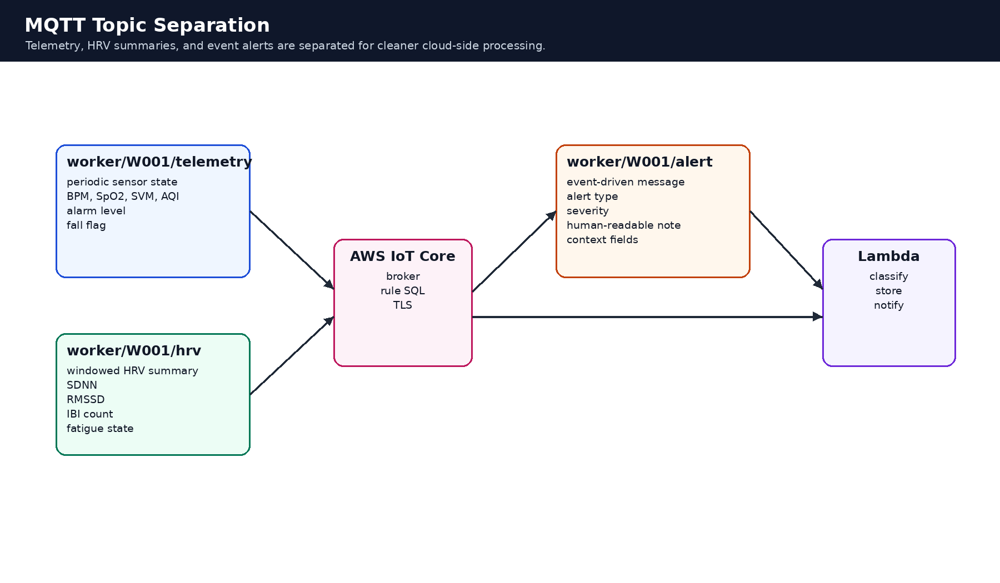

# Communication Workflow

## 1. Overview

The FOURUT communication workflow connects local worker sensing, environmental sensing, edge processing, and cloud services. The system uses a two-level communication model:

1. **Local edge communication**, where the environmental node sends air-quality data to the main gateway using ESP-NOW.
2. **Cloud communication**, where the main gateway publishes combined worker telemetry, HRV summaries, and alert events to AWS IoT Core using MQTT over Wi-Fi.

Only the main gateway requires cloud credentials. This keeps the environmental node lightweight and reduces the number of devices that need AWS certificates.



---

## 2. Communication Components

| Component | Role | Communication Method |
|---|---|---|
| Environmental node | Reads PM or AQI-related values | sensor interface and ESP-NOW |
| Main ESP32 gateway | Receives environmental data and collects worker data | ESP-NOW, local sensors, Wi-Fi, MQTT |
| AWS IoT Core | Secure cloud ingestion layer | MQTT over TLS |
| AWS Lambda | Serverless event processor | IoT Rule trigger |
| DynamoDB | Structured state storage | AWS SDK |
| S3 | Detailed event archive | AWS SDK |
| SNS or dashboard layer | Supervisor notification and review | AWS services or application layer |

---

## 3. End-to-End Data Flow

The complete communication path is:

```text
PM2.5 / AQI sensor
  -> Environmental ESP32 node
  -> ESP-NOW local packet
  -> Main ESP32 gateway
  -> MQTT over Wi-Fi
  -> AWS IoT Core
  -> IoT Rule
  -> AWS Lambda
  -> DynamoDB / S3 / SNS / dashboard
```

The environmental node does not publish directly to AWS. The main gateway combines environmental data with biometric and motion data before sending the cloud payload.

---

## 4. ESP-NOW Local Communication

ESP-NOW is used between the environmental node and the gateway because it supports direct ESP32-to-ESP32 communication without requiring the environmental node to connect to Wi-Fi or maintain cloud credentials.

Advantages:

- reduces cloud credential exposure;
- reduces connection complexity for the environmental node;
- supports local sensor expansion;
- reduces bandwidth requirements;
- allows the gateway to centralize telemetry formatting.

Example environmental packet:

```json
{
  "node_id": "env_node_01",
  "pm1_0": 12,
  "pm2_5": 42,
  "pm10": 80,
  "aqi": 95,
  "status": "warning"
}
```

Recommended packet fields:

| Field | Type | Description |
|---|---|---|
| `node_id` | string | environmental node identifier |
| `pm1_0` | number | PM1.0 reading when available |
| `pm2_5` | number | PM2.5 reading |
| `pm10` | number | PM10 reading when available |
| `aqi` | number | computed or mapped air-quality index |
| `status` | string | normal, warning, or danger |
| `timestamp` | number | optional gateway or node timestamp |

---

## 5. Main Gateway Data Fusion

The main gateway combines four groups of information:

| Data Group | Example Fields |
|---|---|
| Biometric data | `bpm`, `spo2`, `sdnn`, `rmssd` |
| Motion data | `svm`, `fall_state`, `fall_detected` |
| Environmental data | `pm2_5`, `pm10`, `aqi`, `air_status` |
| System state | `alarm_level`, `alarm_active`, `battery_level`, `timestamp` |

Example combined telemetry payload:

```json
{
  "worker_id": "W001",
  "bpm": 82,
  "spo2": 97,
  "svm": 9.81,
  "fall_detected": false,
  "aqi": 42,
  "alarm_level": 0,
  "alarm_active": false,
  "timestamp": 1710000000
}
```

---

## 6. MQTT Topic Structure

The communication design separates telemetry, HRV summaries, and alert events.



Recommended topic model:

```text
worker/{worker_id}/telemetry
worker/{worker_id}/hrv
worker/{worker_id}/alert
```

Example for worker `W001`:

```text
worker/W001/telemetry
worker/W001/hrv
worker/W001/alert
```

| Topic | Frequency | Purpose |
|---|---|---|
| `worker/W001/telemetry` | periodic | regular worker and environmental state |
| `worker/W001/hrv` | window-based | fatigue and HRV summary |
| `worker/W001/alert` | event-driven | warning, danger, or emergency event |

This design makes cloud routing easier because each topic has a clear semantic meaning.

---

## 7. Telemetry Payload

The telemetry topic should contain compact state information.

```json
{
  "worker_id": "W001",
  "bpm": 82,
  "spo2": 97,
  "svm": 9.81,
  "aqi": 35,
  "fall_detected": false,
  "alarm_level": 0,
  "alarm_active": false,
  "timestamp": 1710000000
}
```

Recommended schema:

| Field | Description |
|---|---|
| `worker_id` | worker or device identifier |
| `bpm` | heart rate |
| `spo2` | oxygen saturation estimate |
| `svm` | acceleration magnitude |
| `aqi` | environmental air-quality index |
| `fall_detected` | fall status flag |
| `alarm_level` | 0 normal, 1 warning, 2 danger, 3 emergency |
| `alarm_active` | local alarm state |
| `timestamp` | event or publication time |

---

## 8. HRV Payload

The HRV topic stores window-based fatigue indicators.

```json
{
  "worker_id": "W001",
  "sdnn": 42.5,
  "rmssd": 31.8,
  "ibi_count": 128,
  "fatigue_state": "normal",
  "timestamp": 1710000000
}
```

The HRV payload should be published less frequently than telemetry because HRV requires a time window.

---

## 9. Alert Payload

The alert topic is event-driven and should contain enough context for supervisor review.

```json
{
  "worker_id": "W001",
  "alert_type": "FALL",
  "severity": "EMERGENCY",
  "alarm_level": 3,
  "message": "Confirmed fall sequence detected",
  "bpm": 118,
  "spo2": 94,
  "svm": 31.2,
  "aqi": 40,
  "timestamp": 1710000000
}
```

Recommended alert types:

| Alert Type | Meaning |
|---|---|
| `SPO2_WARNING` | oxygen saturation below warning threshold |
| `SPO2_DANGER` | severe oxygen saturation drop |
| `BPM_WARNING` | abnormal heart-rate condition |
| `FATIGUE_WARNING` | low RMSSD over consecutive windows |
| `EXHAUSTION` | low RMSSD combined with elevated heart rate |
| `ENV_WARNING` | elevated air-quality risk |
| `ENV_DANGER` | dangerous air-quality condition |
| `FALL` | confirmed fall event |

---

## 10. AWS IoT Core Workflow

AWS IoT Core acts as the secure ingestion layer.

Responsibilities:

1. authenticate the main gateway using device certificates;
2. receive MQTT messages over TLS;
3. route messages using IoT Rules;
4. forward selected payloads to AWS Lambda or storage targets.

The gateway should use a policy with only the minimum MQTT permissions required for its topics.

---

## 11. Lambda Processing Workflow

AWS Lambda performs cloud-side processing after an IoT Rule forwards the payload.

Recommended processing steps:

1. validate payload schema;
2. normalize field names and units;
3. classify worker status;
4. store structured state in DynamoDB;
5. archive detailed event logs in S3;
6. send notifications for danger or emergency events;
7. return a processing result for logs and debugging.

Possible classification results:

| Status | Meaning |
|---|---|
| `normal` | no active risk condition |
| `warning` | early risk condition |
| `danger` | severe non-fall condition |
| `exhaustion` | fatigue-related danger condition |
| `emergency_fall` | confirmed fall event |

---

## 12. Storage and Notification

| Service | Recommended Use |
|---|---|
| DynamoDB | latest worker state, alarm level, dashboard lookup, recent alerts |
| S3 | raw event logs, HRV history, daily archives, validation records |
| SNS | email or message notification for danger and emergency events |

For normal events, the system can store a compact status update. For danger and emergency events, the system should store detailed context and trigger a notification.

---

## 13. Security Considerations

Sensitive values must never be committed to the repository.

Do not commit:

```text
secrets.h
config.py
.env
*.pem
*.key
*.crt
real AWS endpoint
Wi-Fi password
private supervisor contact details
```

Use example files instead:

```text
secrets.example.h
config.example.py
```

The gateway should be the only device with AWS credentials. Environmental nodes should remain local unless there is a specific reason to provision cloud credentials for them.

---

## 14. Failure Handling

| Failure | Recommended Behavior |
|---|---|
| ESP-NOW packet lost | keep last known environmental value with timeout flag |
| Wi-Fi unavailable | continue local monitoring and alarm logic |
| MQTT publish fails | queue or retry non-critical telemetry, prioritize alerts |
| AWS unavailable | continue local alarm behavior |
| Lambda error | log event and preserve raw payload if possible |
| Notification failure | retry or expose failure state in dashboard |

The local alarm path should not depend on cloud acknowledgement.

---

## 15. Validation Plan

| Test | Expected Result |
|---|---|
| ESP-NOW reception | gateway receives environmental packet and updates AQI |
| Normal telemetry | AWS IoT Core receives telemetry payload |
| HRV payload | HRV summary arrives on the HRV topic |
| Alert payload | danger or emergency event arrives on alert topic |
| Lambda classification | test events produce expected status labels |
| Storage write | DynamoDB and/or S3 records are created |
| Notification | SNS or supervisor alert is triggered for danger/emergency |

---

## 16. Summary

The communication workflow uses ESP-NOW for lightweight local environmental sensing and MQTT over Wi-Fi for cloud telemetry. The main gateway acts as the secure bridge between local sensing and cloud processing. This design minimizes credential exposure, simplifies environmental-node design, and supports scalable cloud-side monitoring and notification.
