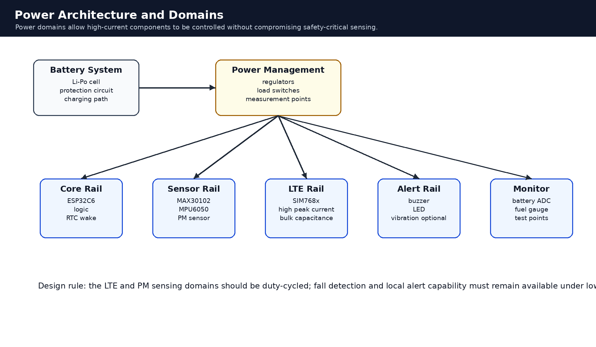
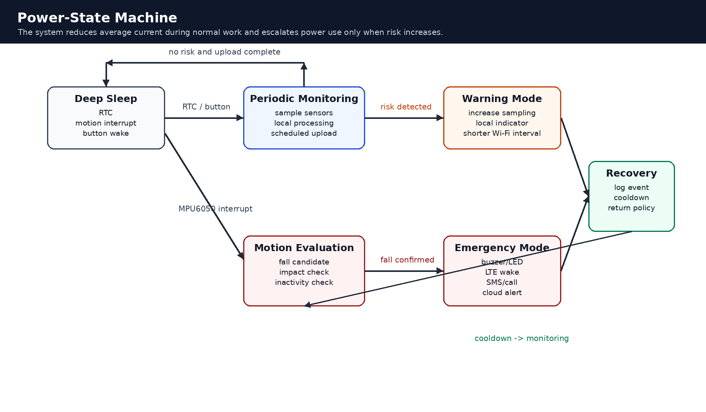

# Power Management

## 1. Overview

Power management is a central requirement for the FOURUT wearable safety-monitoring system. The device is expected to operate during long work periods while maintaining the ability to detect emergency events quickly. The power strategy therefore balances three competing requirements:

1. continuous or periodic safety monitoring;
2. low average current consumption;
3. reliable emergency communication and local alerting.

High-current components such as Wi-Fi, PM sensors, buzzers, and optional cellular modules should be activated only when needed. Safety-critical sensing and local alarm capability should remain available even during energy-saving operation.

---

## 2. Power-Management Objectives

| Objective | Explanation |
|---|---|
| Reduce idle current | Keep radios and high-current sensors inactive when not required. |
| Preserve emergency response | Maintain fall-detection and local alarm capability under low-power policy. |
| Support wearable runtime | Use duty cycling and interrupt-driven wake-up to extend battery life. |
| Protect power integrity | Prevent brownout during Wi-Fi or cellular current bursts. |
| Enable validation | Provide a clear energy-budget method and power-testing plan. |

---

## 3. Power Domains

The system should be divided into controllable power domains.



| Domain | Components | Control Strategy |
|---|---|---|
| Core domain | ESP32 gateway, RTC, logic interfaces | active during processing, sleep during idle |
| Physiological sensing domain | MAX30102 | periodic sampling or standby |
| Motion sensing domain | MPU6050 | low-power motion monitoring and interrupt |
| Environmental sensing domain | PM2.5 or AQI sensor | duty-cycled sampling or power gating |
| Communication domain | Wi-Fi, optional SIM768x | scheduled Wi-Fi, cellular only for emergency |
| Alert domain | buzzer, LED, vibration motor if used | event-driven activation |
| Battery support domain | protection circuit, charger, regulators | always available for safety |

---

## 4. Component Power Profile

The values below are design references and should be measured on the actual prototype.

| Component | Function | Current Behavior | Power Strategy |
|---|---|---:|---|
| MAX30102 | heart rate and SpO2 sensing | low to moderate sensor current | tune LED current and sampling rate |
| MPU6050 | motion and fall detection | low-power motion monitoring possible | use interrupt mode when feasible |
| PM2.5 sensor | environmental monitoring | higher current than small sensors | duty-cycle or power-gate |
| ESP32 gateway | processing and Wi-Fi | high current during radio activity | sleep between processing/upload cycles |
| SIM768x or equivalent | cellular SMS/voice fallback | high current and peak bursts | keep off until emergency |
| Buzzer / LED | local alert | event-dependent | off during normal state |

The most important optimization is reducing the active time of radios and high-current sensors.

---

## 5. Power-State Machine



The system can operate in the following states.

| State | Purpose | Active Components |
|---|---|---|
| Deep sleep | lowest-power idle state | RTC and selected wake sources |
| Periodic monitoring | routine sensing and local processing | ESP32, sensors as scheduled |
| Motion evaluation | fall-candidate assessment | ESP32 and MPU6050 |
| Warning mode | elevated observation | sensors, local indicator, Wi-Fi |
| Emergency mode | critical event response | ESP32, alarm, Wi-Fi, optional cellular |
| Recovery mode | post-event stabilization | ESP32, logging, cooldown |

State transitions are driven by timers, motion interrupts, button events, and risk classification.

---

## 6. Duty-Cycle Strategy

### 6.1 Physiological Sensing

The MAX30102 can reduce average current by tuning:

- LED pulse amplitude;
- sampling rate;
- pulse width;
- sample averaging;
- standby duration between measurements.

The chosen configuration should balance signal quality and battery lifetime.

### 6.2 Motion Sensing

The MPU6050 should remain available for motion monitoring. When supported by the hardware and firmware, it can provide motion interrupts to wake the ESP32 for detailed fall evaluation.

### 6.3 Environmental Sensing

The PM sensor should not remain fully active unless the deployment requires continuous air-quality monitoring.

Recommended policy:

```text
normal state:
  sample periodically
  keep PM sensor off or idle between samples

warning state:
  increase sample frequency
  confirm whether the air-quality condition persists

danger state:
  maintain higher observation frequency
  alert the worker and supervisor
```

### 6.4 Communication

Wi-Fi and cellular communication should be treated as high-cost operations.

| Mode | Communication Strategy |
|---|---|
| Normal | scheduled Wi-Fi telemetry |
| Stable normal | lower telemetry frequency |
| Warning | increased Wi-Fi telemetry frequency |
| Emergency | immediate alert attempt and optional cellular activation |
| Recovery | log event and return unused radios to low-power state |

---

## 7. Communication Power Policy

Wi-Fi is suitable for routine telemetry and dashboard synchronization. Cellular communication is more power intensive and should be reserved for critical events or Wi-Fi failure during emergency cases.

Recommended Wi-Fi workflow:

```text
collect sensor features
  -> classify locally
  -> build compact telemetry
  -> enable Wi-Fi if scheduled
  -> publish MQTT payload
  -> disable Wi-Fi or return to sleep
```

Recommended cellular workflow:

```text
emergency detected
  -> activate local alarm
  -> wake or power on cellular module
  -> register to network
  -> send SMS or call if configured
  -> log result
  -> shut down cellular module
```

---

## 8. Battery and Regulation Design

### 8.1 Battery Requirements

The battery should provide:

- sufficient capacity for the target work period;
- ability to support peak current during communication;
- protection against overcharge, overdischarge, and short circuit;
- mechanical safety inside the enclosure;
- stable operation under temperature and vibration conditions.

### 8.2 Voltage Regulation

The power design should include:

- a stable core logic rail;
- low-noise supply for sensors;
- a dedicated high-current path for cellular communication if used;
- adequate decoupling near radio modules;
- common ground reference;
- test points for current and voltage measurement.

### 8.3 LTE Power Rail Considerations

If a SIM768x or similar cellular module is integrated, its power rail should support short-duration current peaks.

Design recommendations:

- use a regulator with sufficient peak-current capacity;
- place bulk capacitance close to the module;
- keep power traces short and wide;
- route high-current paths away from optical and analog sensing lines;
- validate voltage stability during SMS or voice-call attempts.

---

## 9. Low-Battery Policy

| Battery State | Recommended Behavior |
|---|---|
| Normal | full monitoring and scheduled telemetry |
| Low battery | reduce PM sampling and routine upload frequency |
| Critical battery | preserve fall detection and local alarm capability |
| Shutdown threshold | save state, notify if possible, and enter safe shutdown |

The system should reserve enough energy for at least one emergency alert sequence where possible.

---

## 10. Energy-Budget Method

Average current can be estimated by duty-cycle weighting:

```text
I_avg = Σ(I_i × D_i)
```

Where:

- `I_i` is the current of component or mode `i`;
- `D_i` is the fraction of time spent in that component or mode.

Estimated battery runtime:

```text
Runtime_hours = Battery_capacity_mAh / I_avg_mA
```

This estimate should be validated experimentally because real runtime depends on regulator efficiency, wireless signal strength, sensor settings, battery aging, and event frequency.

Example budget table:

| Component or Mode | Current | Duty Cycle | Average Contribution |
|---|---:|---:|---:|
| ESP32 active processing | measured value | `D_core_active` | `I_core × D_core_active` |
| ESP32 sleep | measured value | `D_sleep` | `I_sleep × D_sleep` |
| MAX30102 sensing | measured value | `D_ppg` | `I_ppg × D_ppg` |
| MPU6050 monitoring | measured value | `D_imu` | `I_imu × D_imu` |
| PM sensor active | measured value | `D_pm` | `I_pm × D_pm` |
| Wi-Fi upload | measured value | `D_wifi` | `I_wifi × D_wifi` |
| Cellular emergency | measured value | `D_cellular` | `I_cellular × D_cellular` |
| Buzzer / LED | measured value | `D_alert` | `I_alert × D_alert` |

---

## 11. Firmware-Level Power Policy

### 11.1 Normal Mode

```text
1. Wake by RTC or scheduler.
2. Read required sensors.
3. Process features locally.
4. Publish telemetry if scheduled.
5. Return to low-power state if no risk is detected.
```

### 11.2 Warning Mode

```text
1. Increase sampling frequency.
2. Activate local warning indicator if needed.
3. Publish warning telemetry.
4. Continue observing the condition.
5. Escalate if the condition persists or worsens.
```

### 11.3 Emergency Mode

```text
1. Keep gateway active.
2. Activate buzzer and LED immediately.
3. Publish alert if Wi-Fi is available.
4. Activate cellular fallback if configured.
5. Store or queue emergency context.
6. Enter recovery mode after notification attempt.
```

### 11.4 Recovery Mode

```text
1. Maintain cooldown to avoid repeated duplicate alerts.
2. Log the event.
3. Restore normal sampling and telemetry intervals.
4. Return to normal monitoring.
```

---

## 12. Thermal and Safety Considerations

Wearable operation requires electrical and thermal safety.

Recommendations:

- avoid continuous cellular operation;
- limit repeated emergency retries;
- separate high-current components from skin-contact surfaces;
- use protected rechargeable cells;
- avoid exposed conductive terminals;
- ensure mechanical strain relief;
- validate enclosure temperature during operation;
- protect against dust and sweat ingress where possible.

---

## 13. Power Testing Plan

### 13.1 Static Current Test

Measure the current draw of each component:

- ESP32 active;
- ESP32 sleep;
- MAX30102 sensing;
- MPU6050 monitoring;
- PM sensor active and idle;
- Wi-Fi upload;
- cellular startup and transmission if used;
- buzzer and LED.

### 13.2 Dynamic Workflow Test

Measure current during full workflows:

- normal monitoring cycle;
- scheduled Wi-Fi telemetry;
- warning mode;
- emergency mode;
- recovery mode;
- low-battery behavior.

### 13.3 Runtime Test

Test battery life under representative scenarios:

| Scenario | Purpose |
|---|---|
| normal work shift | estimate practical baseline runtime |
| frequent telemetry | evaluate Wi-Fi energy cost |
| high PM sampling | evaluate environmental sensing cost |
| repeated warnings | evaluate elevated monitoring cost |
| emergency event | verify alert energy reserve |

### 13.4 Power Integrity Test

Validate voltage stability during:

- Wi-Fi transmission;
- PM sensor activation;
- buzzer activation;
- cellular startup;
- SMS or voice-call transmission;
- transition from sleep to active mode.

---

## 14. Design Risks and Mitigations

| Risk | Cause | Impact | Mitigation |
|---|---|---|---|
| Rapid battery drain | continuous Wi-Fi, PM sensor, or cellular use | short runtime | duty-cycle high-current modules |
| Brownout | radio current burst | reset or failed notification | stronger regulator and bulk capacitance |
| Missed fall event | overly aggressive sleep policy | safety risk | keep motion interrupt active |
| Sensor noise | power or RF interference | inaccurate reading | separate rails and improve grounding |
| Overheating | prolonged communication or charging | user discomfort | limit duty cycle and validate enclosure |
| Critical battery failure | low reserve energy | missed emergency alert | preserve emergency energy budget |

---

## 15. Summary

The FOURUT power-management strategy uses power domains, duty-cycled sensing, interrupt-driven wake-up, scheduled communication, and emergency-only high-current activation. The design goal is not simply to minimize current; it is to minimize current while preserving emergency responsiveness. Final deployment should include measured current profiles, runtime results, and power-integrity validation.
