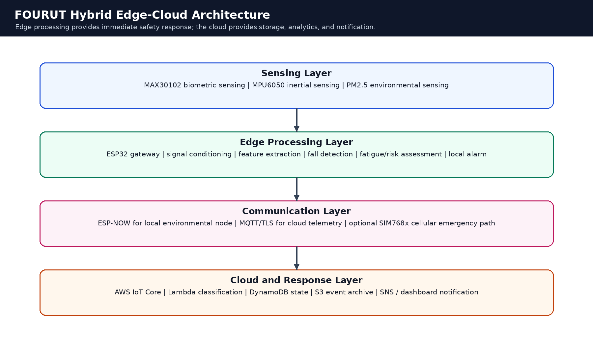
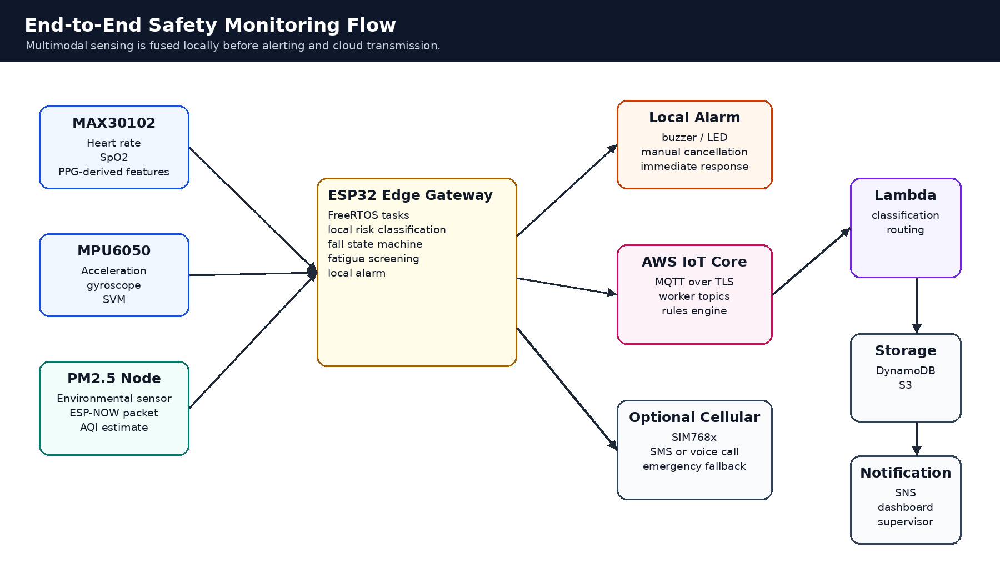
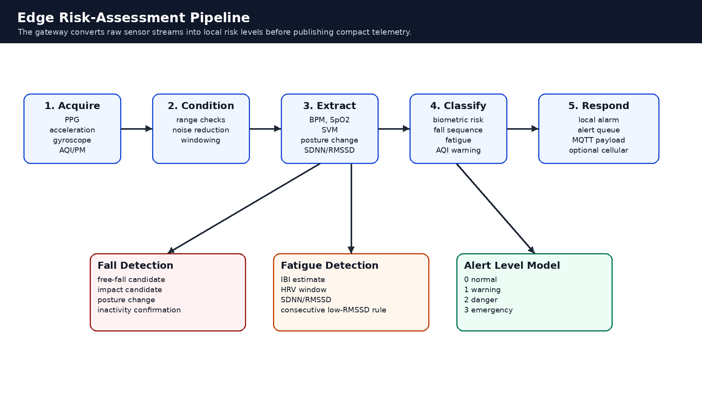

# FOURUT System Architecture

## 1. Purpose and Scope

FOURUT is a wearable hybrid IoT system designed for real-time health and safety monitoring of construction and industrial workers. The system focuses on hazards that may not be detected by conventional personal protective equipment alone, including abnormal heart rate, reduced blood oxygen saturation, fall events, fatigue-related physiological changes, and exposure to poor air quality.

The architecture combines physiological sensing, inertial motion monitoring, environmental sensing, edge processing, local alerting, and cloud-based monitoring. Its main objective is to reduce emergency response latency while still preserving centralized visibility for supervisors and safety managers.

The system should be interpreted as a research and prototype platform. It is not a certified medical device and should not be described as a replacement for clinical assessment, industrial safety certification, or professional emergency-response procedures.



---

## 2. Architectural Goals

The system architecture is designed around five goals.

| Goal | Explanation |
|---|---|
| Low-latency emergency response | Critical conditions should trigger a local alarm at the edge without waiting for cloud processing. |
| Multimodal risk detection | Physiological, motion, and environmental data are evaluated together to improve situational awareness. |
| Network resilience | Routine telemetry can use Wi-Fi and MQTT, while emergency response can be supported by local alarms and optional cellular fallback. |
| Wearable practicality | The device should support duty-cycled sensing and communication to preserve battery life. |
| Academic reproducibility | Design decisions, thresholds, limitations, and validation procedures should be documented clearly. |

---

## 3. Layered Architecture

FOURUT uses a four-layer architecture:

```text
Sensing Layer
  -> Edge Processing Layer
  -> Communication Layer
  -> Cloud and Response Layer
```

| Layer | Main Function | Representative Components |
|---|---|---|
| Sensing layer | Collects physiological, motion, and environmental data | MAX30102, MPU6050, PM2.5 sensor |
| Edge processing layer | Performs local feature extraction, risk classification, and alarm control | ESP32 gateway firmware |
| Communication layer | Transfers data locally and to the cloud | ESP-NOW, MQTT over Wi-Fi, optional cellular module |
| Cloud and response layer | Stores records, classifies events, and supports supervisor notification | AWS IoT Core, Lambda, DynamoDB, S3, SNS |

The layered organization separates acquisition, decision-making, communication, and response. This improves maintainability and allows individual subsystems to be tested independently.

---

## 4. Sensing Layer

### 4.1 Physiological Sensing

The physiological subsystem uses a MAX30102 optical sensor to estimate:

- heart rate;
- blood oxygen saturation;
- pulse-derived timing information for prototype fatigue screening.

The sensor is useful for detecting physiological stress indicators such as abnormal heart rate and low SpO2. In a field prototype, readings may be affected by movement, poor contact, sweat, dust, and sensor placement. For that reason, biometric data should be filtered and interpreted as screening information rather than clinical measurement.

### 4.2 Motion Sensing

The motion subsystem uses an MPU6050 inertial measurement unit. It provides three-axis acceleration and angular velocity data.

The firmware computes Signal Vector Magnitude:

```text
SVM = sqrt(ax² + ay² + az²)
```

SVM is used to identify fall-related stages such as free fall, impact, and post-impact inactivity. Gyroscope data can support stillness detection and reduce false positives during normal work movements.

### 4.3 Environmental Sensing

The environmental subsystem monitors particulate matter or an AQI-derived risk score. In the reference design, a separate environmental node can read the PM sensor and transmit air-quality data to the gateway through ESP-NOW.

This separation keeps the wearable gateway lighter and allows additional environmental nodes to be added later.

---

## 5. Edge Processing Layer

The ESP32 gateway is the local decision unit. It performs:

- sensor acquisition and preprocessing;
- feature extraction;
- biometric threshold evaluation;
- fall-detection state tracking;
- fatigue-risk screening;
- environmental-risk integration;
- local alarm activation;
- telemetry and alert publishing.

The edge layer is the most important safety component because it can trigger a local alarm immediately. Cloud communication is useful for records and notification, but it should not be required for first response.



---

## 6. Edge Risk-Assessment Pipeline

The gateway follows a compact decision pipeline:

1. **Acquire data** from local sensors and the environmental node.
2. **Condition signals** using range checks, smoothing, or windowing.
3. **Extract features** such as BPM, SpO2, SVM, posture change, SDNN, and RMSSD.
4. **Classify risk** using rule-based thresholds and state-machine logic.
5. **Respond** through local alarm, cloud telemetry, alert payload, or optional cellular fallback.



This edge-first pipeline reduces response latency and reduces the amount of raw data transmitted to the cloud.

---

## 7. Operating Modes

| Mode | Description | Typical Behavior |
|---|---|---|
| Normal monitoring | No active risk condition | Periodic sensing, local processing, scheduled telemetry |
| Warning | Mild abnormality detected | Higher attention, local warning, more frequent telemetry |
| Danger | Critical but non-fall condition | Strong alarm, cloud alert, supervisor notification |
| Emergency | Confirmed fall or severe event | Immediate alarm, emergency alert, optional cellular fallback |
| Recovery | Post-event stabilization | Event logging, cooldown, return to monitoring |

---

## 8. Risk Detection Logic

### 8.1 SpO2 Risk

| Condition | Suggested Threshold | Response |
|---|---:|---|
| Normal | `SpO2 >= 90%` | Continue monitoring |
| Warning | `SpO2 < 90%` | Generate warning |
| Danger | `SpO2 < 80%` | Generate danger alert |

These thresholds are suitable for prototype screening. Final deployment should validate thresholds with domain expertise and field data.

### 8.2 Heart-Rate Risk

| Condition | Suggested Threshold | Response |
|---|---:|---|
| Bradycardia warning | `BPM < 50` | Generate warning |
| Tachycardia warning | `BPM > 120` | Generate warning or escalation check |
| Exhaustion support condition | `BPM > 110` with low RMSSD | Support fatigue escalation |

Sustained duration checks are recommended to reduce false warnings during physical work.

### 8.3 Fall Detection

The fall detector should use a staged model:

```text
free-fall candidate
  -> impact candidate
  -> posture change
  -> post-impact stillness
  -> confirmed fall
```

Representative parameters:

| Parameter | Typical Value | Purpose |
|---|---:|---|
| Free-fall threshold | `0.5g` or approximately `4.9 m/s²` | Detect loss of support |
| Impact threshold | `3g` or approximately `29.4 m/s²` | Detect sudden deceleration |
| Impact window | `1.5 s` | Require impact soon after free fall |
| Inactivity duration | `3 s` | Confirm post-impact stillness |
| Posture change threshold | `35°` | Support discrimination between fall and normal motion |

A staged detector is preferable to a single acceleration threshold because construction activity can include abrupt movement, vibration, and temporary impact-like events.

### 8.4 Environmental Risk

| AQI Range | Risk Level | Response |
|---:|---|---|
| `AQI < 75` | Normal | Continue monitoring |
| `75 <= AQI <= 150` | Warning | Increase attention or notify |
| `AQI > 150` | Danger | Generate environmental danger alert |

The exact AQI mapping should match the sensor calibration and deployment environment.

### 8.5 Fatigue Risk

Prototype fatigue screening can use HRV-related indicators:

| Condition | Interpretation | Response |
|---|---|---|
| `RMSSD < 20 ms` for consecutive windows | fatigue warning | Level-1 warning |
| `RMSSD < 15 ms` and elevated BPM | exhaustion risk | Level-2 danger |

A production implementation should use beat-level PPG peak detection rather than BPM-derived IBI.

---

## 9. Hardware Components

| Component | Role | Notes |
|---|---|---|
| MAX30102 | Heart rate and SpO2 sensing | Sensitive to motion artifacts and contact quality |
| MPU6050 | Acceleration and gyroscope monitoring | Supports fall-state tracking |
| PM2.5 or AQI sensor | Environmental hazard monitoring | Can be placed on a separate ESP32 node |
| ESP32 gateway | Local computation and communication | Runs edge logic and cloud publishing |
| Buzzer / LED | Local alarm | Must remain available even if cloud communication fails |
| SIM768x or equivalent module | Optional cellular emergency path | Useful for deployment extension, not required for Wi-Fi-only prototype |

---

## 10. Implementation Status and Deployment Extension

To keep the documentation accurate, separate the implemented prototype from the intended deployment extension.

| Feature | Prototype Level | Deployment Extension |
|---|---|---|
| Edge sensing and processing | implemented in ESP32 firmware | field-calibrated firmware |
| MAX30102 and MPU6050 integration | implemented or directly supported | improved signal filtering and enclosure design |
| ESP-NOW environmental node | supported by architecture | multiple environmental nodes |
| MQTT to AWS IoT Core | implemented or expected in cloud prototype | production certificate management |
| Lambda classification | implemented in cloud workflow | monitored and versioned classifier |
| SIM768x cellular alert | optional or simulated unless hardware is integrated | real SMS/voice-call fallback |
| Battery management | documented design | measured runtime and power hardware validation |

This distinction makes the repository more credible because it avoids presenting planned hardware as already validated.

---

## 11. Validation Requirements

A strong system-architecture section should be supported by repeatable evidence.

| Test | Expected Evidence |
|---|---|
| Normal monitoring | stable telemetry payload and dashboard record |
| SpO2 warning | warning alert at expected threshold |
| Heart-rate warning | abnormal BPM alert with duration rule |
| Fall sequence | free-fall, impact, inactivity, and alarm state visible in logs |
| Environmental warning | AQI or PM threshold produces warning |
| MQTT delivery | payload visible in AWS IoT Core |
| Lambda classification | test events classified as expected |
| Notification | SNS or email alert for danger/emergency events |
| Runtime estimate | measured or calculated battery duration |

---

## 12. Limitations

The current architecture has several limitations:

- biometric measurements can be affected by motion artifacts;
- HRV derived from BPM is not equivalent to clinical-grade beat-to-beat HRV;
- rule-based thresholds require calibration for individual workers and environments;
- fall detection may still produce false positives during abrupt work activity;
- cloud communication depends on network availability;
- cellular fallback requires additional hardware and power validation;
- a wearable enclosure must address dust, sweat, vibration, and mechanical stress.

---

## 13. Summary

FOURUT uses a hybrid edge-cloud architecture for proactive worker safety monitoring. The system collects physiological, motion, and environmental data, processes safety-critical conditions locally, and publishes structured telemetry to cloud services for storage and notification. This design balances low-latency emergency response with centralized monitoring and long-term analysis.
