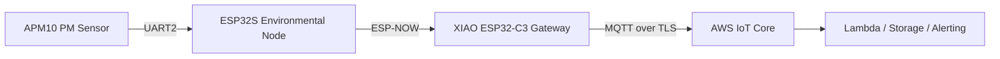
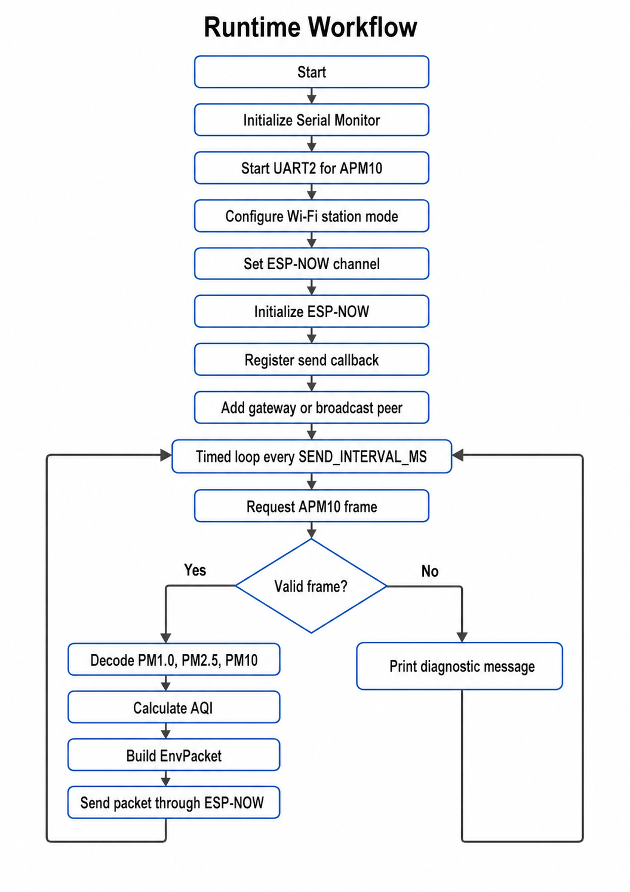

# FOURUT APM10 ESP-NOW Environmental Node

## Overview

This repository contains the firmware for the environmental sensing node used in the FOURUT worker health and safety monitoring prototype. The node runs on an ESP32S NodeMCU or ESP32 DevKit board, reads particulate matter measurements from an APM10 UART sensor, calculates a PM2.5-based AQI value for prototype visualization, and sends the resulting environmental packet to a XIAO ESP32-C3 gateway using ESP-NOW.

The node has a bounded responsibility within the system architecture. It performs local air-quality sensing and short-range wireless transmission only. It does not connect to AWS IoT Core, publish MQTT messages, or process worker biometric data. Cloud communication is handled by the gateway after the ESP-NOW packet is received.

## System Context



The environmental node extends the FOURUT pipeline by adding air-quality data to the worker safety telemetry stream. The gateway combines this environmental packet with health, motion, and alarm data before forwarding the integrated record to the cloud backend.

## Repository Contents

```text
.
├── esp32_apm10_espnow_node.ino   # ESP32 environmental node firmware
└── README.md                     # Project documentation
```

## Hardware Requirements

| Component | Role |
|---|---|
| ESP32S NodeMCU or ESP32 DevKit | Main controller for the environmental node |
| APM10 UART particulate matter sensor | Provides PM1.0, PM2.5, and PM10 measurements |
| XIAO ESP32-C3 gateway | Receives ESP-NOW packets and forwards integrated telemetry |
| USB cable | Programming and Serial Monitor access |
| Stable power source | Powers the ESP32 and APM10 sensor |

## Wiring

The firmware communicates with the APM10 sensor through UART2.

| APM10 Pin | ESP32 Pin | Description |
|---|---|---|
| TX | GPIO16 | Sensor transmit line connected to ESP32 receive pin |
| RX | GPIO17 | Sensor receive line connected to ESP32 transmit pin |
| GND | GND | Common ground |
| VCC | Sensor-specific supply voltage | Power input for the APM10 module |

Firmware pin definitions:

```cpp
#define PM_RX_PIN 16
#define PM_TX_PIN 17
```

The UART connection must use crossed TX/RX wiring. If the Serial Monitor reports that no valid APM10 frame is detected, first verify the UART pins, shared ground, sensor power, and baud rate.

## Software Requirements

The firmware targets the Arduino ESP32 framework and uses the following libraries:

```cpp
#include <Arduino.h>
#include <WiFi.h>
#include <esp_now.h>
#include <esp_wifi.h>
#include <math.h>
```

The source also conditionally includes Arduino ESP32 and ESP-IDF version headers when available. This keeps the ESP-NOW callback definition compatible with different Arduino ESP32 core versions.

## Configuration Summary

The main deployment parameters are defined near the beginning of `esp32_apm10_espnow_node.ino`.

| Parameter | Current Value | Description |
|---|---:|---|
| `ESPNOW_WIFI_CHANNEL` | `13` | ESP-NOW channel; must match the gateway channel |
| `USE_BROADCAST` | `false` | Uses direct peer transmission when set to `false` |
| `GATEWAY_MAC` | `64:E8:33:84:12:30` | Target gateway MAC address for direct mode |
| `PM_RX_PIN` | `16` | ESP32 UART2 RX pin |
| `PM_TX_PIN` | `17` | ESP32 UART2 TX pin |
| `PM_BAUD` | `1200` | UART baud rate used for the APM10 sensor |
| `SEND_INTERVAL_MS` | `2000` | Interval between sensor reads and transmissions |
| `APM10_RESPONSE_TIMEOUT_MS` | `700` | Maximum wait time for an APM10 response frame |
| `STRICT_APM10_CHECKSUM` | `false` | Allows operation across checksum variants during prototype testing |
| `PRINT_RAW_APM10_RESPONSE` | `false` | Enables raw UART frame printing for debugging |

The ESP-NOW channel must match the channel used by the XIAO gateway. In direct mode, `GATEWAY_MAC` must match the MAC address printed by the gateway firmware.

## Communication Architecture

```text
+-----------------------------+
|        APM10 Sensor         |
|-----------------------------|
| PM1.0, PM2.5, PM10 readings |
+--------------+--------------+
               |
               | PM response frame
               v
+-----------------------------+
| ESP32 Environmental Node    |
|-----------------------------|
| Send read command           |
| Validate APM10 frame        |
| Decode PM values            |
| Calculate PM2.5-based AQI   |
| Build EnvPacket             |
+--------------+--------------+
               |
               | ESP-NOW packet
               v
+-----------------------------+
| XIAO ESP32-C3 Gateway       |
|-----------------------------|
| Receive EnvPacket           |
| Merge with worker telemetry |
| Prepare MQTT payload        |
+--------------+--------------+
               |
               | MQTT over TLS
               v
+-----------------------------+
| AWS IoT Pipeline            |
|-----------------------------|
| Cloud ingestion             |
| Processing and storage      |
| Alert handling              |
+-----------------------------+
```

## Runtime Workflow



If ESP-NOW initialization fails during setup, the firmware waits for five seconds and then restarts the board. This behavior prevents silent startup failures during demonstrations or unattended testing.

## APM10 Sensor Frame Handling

The firmware sends the following command to request PM1.0, PM2.5, and PM10 data:

```cpp
const uint8_t APM10_CMD_READ_ALL[] = {0xFE, 0xA5, 0x00, 0x01, 0xA6};
```

The expected response layout is:

```text
FE A5 02 00 DF11 DF12 DF21 DF22 DF31 DF32 CS
```

The particle concentration fields are decoded as big-endian 16-bit values.

| Byte Pair | Decoded Field |
|---|---|
| `DF11 DF12` | PM1.0 |
| `DF21 DF22` | PM2.5 |
| `DF31 DF32` | PM10 |

Frame processing consists of five steps: clear stale UART bytes, send the read command, collect response bytes until timeout, locate the `FE A5` frame header, and extract the particulate matter values. Checksum verification is supported but disabled by default because APM10 firmware variants may differ in checksum behavior.

## ESP-NOW Packet Format

The sender and gateway must use identical packet structure, field order, data types, and packing behavior. The current packet definition is:

```cpp
#define ENV_PACKET_MAGIC   0x4655
#define ENV_PACKET_VERSION 1
#define ENV_NODE_ID        1

struct __attribute__((packed)) EnvPacket {
    uint16_t magic;
    uint8_t version;
    uint8_t node_id;
    uint32_t seq;
    float pm1_0;
    float pm2_5;
    float pm10;
    int16_t aqi;
    uint16_t battery_mv;
    uint32_t uptime_ms;
};
```

| Field | Type | Description |
|---|---|---|
| `magic` | `uint16_t` | Packet identifier used for gateway-side validation |
| `version` | `uint8_t` | Packet format version |
| `node_id` | `uint8_t` | Environmental node identifier |
| `seq` | `uint32_t` | Incrementing packet sequence number |
| `pm1_0` | `float` | PM1.0 concentration |
| `pm2_5` | `float` | PM2.5 concentration |
| `pm10` | `float` | PM10 concentration |
| `aqi` | `int16_t` | AQI value calculated from PM2.5 |
| `battery_mv` | `uint16_t` | Battery voltage placeholder; currently set to `0` |
| `uptime_ms` | `uint32_t` | Node uptime from `millis()` |

The `magic` and `version` fields allow the gateway to reject incompatible or malformed packets before using the environmental data.

## AQI Calculation

The firmware calculates AQI from PM2.5 using breakpoint interpolation. Before interpolation, PM2.5 is truncated to one decimal place:

```cpp
float c = floor(pm25 * 10.0f) / 10.0f;
```

| PM2.5 Concentration Range | AQI Range |
|---:|---:|
| 0.0–12.0 | 0–50 |
| 12.1–35.4 | 51–100 |
| 35.5–55.4 | 101–150 |
| 55.5–150.4 | 151–200 |
| 150.5–250.4 | 201–300 |
| 250.5–350.4 | 301–400 |
| 350.5–500.4 | 401–500 |

Values above the supported range are capped at `500`, and negative readings return `-1`. The AQI value is intended for prototype visualization and system integration testing. For deployment, the calculation should be aligned with the official air-quality standard selected for the target region.

## Transmission Modes

### Direct Peer Mode

Direct mode sends packets to one configured gateway MAC address:

```cpp
#define USE_BROADCAST false
uint8_t GATEWAY_MAC[6] = {0x64, 0xE8, 0x33, 0x84, 0x12, 0x30};
```

This mode is recommended for final demonstration because delivery status can be associated with a specific receiver.

### Broadcast Mode

Broadcast mode sends packets to all ESP-NOW receivers on the same channel:

```cpp
#define USE_BROADCAST true
uint8_t BROADCAST_MAC[6] = {0xFF, 0xFF, 0xFF, 0xFF, 0xFF, 0xFF};
```

This mode is useful during early testing when the gateway MAC address has not yet been confirmed.

## Serial Monitor Output

At startup, the firmware prints the node configuration, UART pin mapping, node MAC address, target MAC address, and ESP-NOW channel.

A successful transmission appears as:

```text
SEND | seq:1 PM1.0:10.0 PM2.5:18.0 PM10:30.0 AQI:63 -> queued
ESP-NOW callback: delivered
```

The `queued` status indicates that the ESP-NOW send request was accepted. The `delivered` callback indicates that ESP-NOW reported successful delivery to the peer. In broadcast mode, callback behavior may be less informative than in direct peer mode.

If no valid sensor frame is received, the firmware periodically prints:

```text
No valid APM10 frame yet. Check PM_BAUD, TX/RX, power, GND, and SET/UART mode.
```

## Build and Deployment

1. Open `esp32_apm10_espnow_node.ino` in the Arduino IDE.
2. Select an ESP32 DevKit-compatible board profile.
3. Confirm that the APM10 sensor is wired to GPIO16 and GPIO17.
4. Set `ESPNOW_WIFI_CHANNEL` to the channel used by the gateway.
5. Set `USE_BROADCAST` according to the test stage.
6. In direct mode, update `GATEWAY_MAC` using the MAC address printed by the gateway.
7. Upload the firmware to the ESP32 node.
8. Open the Serial Monitor at `115200` baud.
9. Verify sensor readings, packet sequence numbers, and ESP-NOW delivery status.

## Gateway Compatibility Checklist

The gateway firmware must match the environmental node in the following items:

| Requirement | Expected Match |
|---|---|
| ESP-NOW channel | Same value as `ESPNOW_WIFI_CHANNEL` |
| Packet structure | Same `EnvPacket` definition |
| Packet identifier | Same `ENV_PACKET_MAGIC` value |
| Packet version | Same `ENV_PACKET_VERSION` value |
| Field layout | Same order, type, and packing |
| Node identification | Compatible `node_id` handling |

If the gateway receives incorrect PM values, compare the sender and receiver packet structures first. Mismatched packing or field types are common causes of corrupted decoded values.

## Validation Checklist

### Sensor Validation

- The APM10 sensor is powered at the correct voltage.
- APM10 TX is connected to ESP32 GPIO16.
- APM10 RX is connected to ESP32 GPIO17.
- ESP32 and APM10 share a common ground.
- `PM_BAUD` matches the sensor's UART configuration.
- The Serial Monitor shows PM1.0, PM2.5, and PM10 values.

### ESP-NOW Validation

- The gateway is powered and running before testing.
- The node and gateway use the same ESP-NOW channel.
- `GATEWAY_MAC` matches the gateway MAC address in direct mode.
- The sender prints `queued`.
- The send callback prints `delivered` in direct mode.
- The gateway prints matching PM and AQI values.

### System Validation

- Packet sequence numbers increase over time.
- AQI changes consistently with PM2.5 changes.
- The gateway marks the environmental node as online after packets are received.
- Cloud telemetry from the gateway includes environmental fields.

## Troubleshooting

| Symptom | Likely Cause | Check |
|---|---|---|
| No valid APM10 frame | TX/RX wiring is incorrect | Confirm crossed UART wiring |
| No valid APM10 frame | Wrong baud rate | Test the baud rate supported by the sensor |
| No valid APM10 frame | Sensor power issue | Check VCC, GND, and supply stability |
| Raw bytes appear but no valid frame | Different APM10 protocol variant | Enable `PRINT_RAW_APM10_RESPONSE` and inspect the frame |
| ESP-NOW send fails | Peer not configured correctly | Check `GATEWAY_MAC` or test broadcast mode |
| `queued` but not `delivered` | Gateway offline, wrong MAC, or wrong channel | Verify gateway power, MAC address, and ESP-NOW channel |
| Gateway receives unrealistic values | Packet structure mismatch | Compare `EnvPacket` on sender and receiver |
| Data stops updating | Sensor timeout or unstable wiring | Check UART cable quality and sensor power |

## Current Limitations

The current implementation is suitable for prototype demonstration and system integration testing. The following constraints should be considered:

- The node performs environmental sensing only; it does not publish directly to AWS IoT Core.
- AQI is calculated from PM2.5 only and is used for demonstration.
- `battery_mv` is reserved but currently transmitted as `0`.
- Sensor reading is polling-based inside the Arduino `loop()`.
- Failed ESP-NOW transmissions are not stored locally.
- ESP-NOW encryption is not enabled.
- Checksum verification is optional to support sensor variants during testing.

## Recommended Improvements

Future revisions may include configurable node IDs, real battery-voltage measurement, ESP-NOW encryption, sensor-specific parser profiles, moving-average filtering for PM readings, explicit sensor fault codes, and LED status indicators for power, sensor, and transmission states.

## Conclusion

This firmware provides the environmental sensing node for the FOURUT prototype. It reads particulate matter data from an APM10 UART sensor, computes a PM2.5-based AQI value, formats the result as a gateway-compatible ESP-NOW packet, and forwards it to the XIAO ESP32-C3 gateway for integration with worker safety telemetry. The implementation is intentionally lightweight and suitable for prototype validation, while leaving clear paths for robustness, security, and deployment-oriented improvements.
