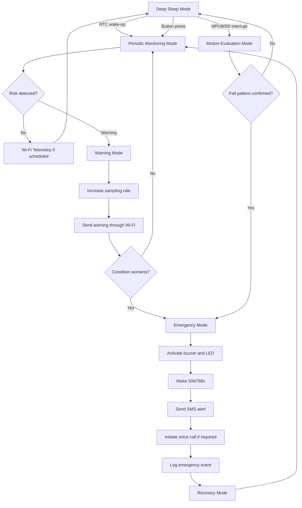

# Power Management

## 1. Overview

This document describes the power-management design of the wearable Hybrid IoT system for real-time health and safety monitoring of construction workers. Since the device is intended for continuous wearable operation in construction and industrial environments, energy efficiency is a critical design requirement.

The system integrates multiple sensing, processing, communication, and alerting components. These components have significantly different power-consumption profiles. Low-power sensors such as the MAX30102 and MPU6050 can operate continuously or semi-continuously, while high-current modules such as the PM2.5 sensor and SIM768x 4G LTE module must be controlled carefully to avoid rapid battery depletion.

The power-management strategy is therefore designed around the following principles:

- Minimize idle current consumption.
- Keep high-current modules inactive unless needed.
- Use interrupt-driven wake-up instead of continuous polling where possible.
- Prioritize low-power communication for routine telemetry.
- Reserve 4G LTE communication for emergency events.
- Maintain emergency responsiveness even during low-power operation.
- Support future integration of energy harvesting.

---

## 2. Power-Management Objectives

The power-management subsystem is designed to satisfy both energy-efficiency and safety requirements.

### 2.1 Functional Objectives

The system shall:

1. Provide stable power to all sensing, processing, alerting, and communication modules.
2. Support continuous or periodic physiological monitoring.
3. Support motion-triggered wake-up for fall detection.
4. Duty-cycle high-power environmental sensing.
5. Keep the 4G LTE module inactive during normal operation.
6. Activate the SIM768x module immediately during emergency events.
7. Allow the ESP32C6 to enter low-power states during idle periods.
8. Preserve enough energy for emergency SMS and voice-call transmission.
9. Support local alerting even when communication modules are unavailable.
10. Enable safe battery operation through protection and regulation.

### 2.2 Non-Functional Objectives

The system should also satisfy the following non-functional objectives:

- **Wearability:** The battery and power circuitry should fit within a compact wearable enclosure.
- **Reliability:** Power delivery must remain stable during high-current communication bursts.
- **Responsiveness:** Low-power operation must not prevent timely emergency detection.
- **Safety:** Battery protection should prevent over-discharge, short circuit, and excessive current draw.
- **Maintainability:** Power rails and test points should support debugging and field maintenance.
- **Scalability:** The design should allow additional sensors or future energy-harvesting modules.

---

## 3. Power Architecture

The wearable device uses a hierarchical power architecture. A rechargeable battery supplies the system through regulated power rails. Low-power sensors and the ESP32C6 share a stable logic supply, while the SIM768x 4G LTE module should be powered through a dedicated high-current rail.

```text
+--------------------------------------------------------------+
|                       Battery System                         |
|                                                              |
|  +-------------------+                                       |
|  | Li-Po Battery     |                                       |
|  +---------+---------+                                       |
|            |                                                 |
|            v                                                 |
|  +-------------------+                                       |
|  | Protection Circuit|                                       |
|  | - Over-discharge  |                                       |
|  | - Over-current    |                                       |
|  | - Short protection|                                       |
|  +---------+---------+                                       |
|            |                                                 |
|            v                                                 |
|  +-------------------+                                       |
|  | Power Switch /    |                                       |
|  | Power Path        |                                       |
|  +---------+---------+                                       |
|            |                                                 |
|   +--------+----------------------+----------------------+    |
|   |                               |                      |    |
|   v                               v                      v    |
| +-------------+             +-------------+          +-------------+
| | 3.3 V Rail  |             | Sensor Rail |          | LTE Rail    |
| | ESP32C6     |             | MAX30102    |          | SIM768x     |
| | Logic GPIO  |             | MPU6050     |          | High Current|
| +-------------+             | PM2.5       |          +-------------+
|                             +-------------+                 |
|                                                              |
|  +--------------------------------------------------------+  |
|  | Optional Charging and Energy Harvesting Interface      |  |
|  | - USB charging                                         |  |
|  | - Solar input                                          |  |
|  | - Charge controller                                    |  |
|  +--------------------------------------------------------+  |
|                                                              |
+--------------------------------------------------------------+
```

---

## 4. Power Domains

The system can be divided into several power domains to support selective activation and energy optimization.

| Power Domain | Components | Control Strategy |
|---|---|---|
| Core domain | XIAO ESP32C6 | Active during processing, deep sleep during idle periods |
| Physiological sensing domain | MAX30102 | Periodic sampling or standby between measurements |
| Motion sensing domain | MPU6050 | Low-power motion monitoring and interrupt generation |
| Environmental sensing domain | PM2.5 sensor | Duty-cycled sampling due to higher current consumption |
| Communication domain | Wi-Fi and SIM768x | Wi-Fi for routine telemetry, 4G only for emergencies |
| Alert domain | Buzzer and LED | Event-driven activation |
| Power-support domain | Battery, regulators, protection circuit | Always available for safe system operation |

This domain-based organization allows the system to keep essential safety functions active while disabling non-essential or high-current modules during low-risk periods.

---

## 5. Component Power Profile

The following table summarizes the approximate current behavior of the main hardware components. These values are used as design references for energy budgeting and should be validated experimentally on the final hardware prototype.

| Component | Function | Typical Current Behavior | Low-Power Mechanism |
|---|---|---:|---|
| MAX30102 | Heart rate and SpO2 sensing | ~6 mA | Standby between optical measurements |
| MPU6050 | 6-DOF motion sensing | ~3.9 mA | Intermittent sampling and motion interrupt |
| PM2.5 Sensor | Fine-dust monitoring | 20-30 mA | Discontinuous laser sampling or power gating |
| XIAO ESP32C6 | Edge processing and Wi-Fi | ~160 mA active | Deep sleep, approximately microamp-level idle current |
| SIM768x 4G LTE | SMS and voice-call alerting | ~200 mA or higher during transmission | Cold-start or sleep until emergency trigger |
| Buzzer | Audible alert | Event-dependent | Off during normal operation |
| LED Indicator | Visual status | Event-dependent | Blink pattern or off during sleep |

The most energy-sensitive components are the ESP32C6 during active wireless operation, the PM2.5 sensor during sampling, and the SIM768x module during cellular registration and transmission.

---

## 6. Power-Management Strategy

The system uses a multi-layered power-management strategy consisting of:

1. **Duty-cycle control**
2. **Interrupt-driven wake-up**
3. **Communication hierarchy**
4. **Event-driven activation**
5. **Local decision-making**
6. **Optional energy harvesting**

Each strategy contributes to reducing average current consumption while preserving emergency responsiveness.

---

## 7. Duty-Cycle Control

Duty cycling is used to reduce the average power consumption of components that do not need to remain continuously active.

### 7.1 PM2.5 Sensor Duty Cycling

The PM2.5 sensor consumes more current than low-power inertial or optical sensors. Therefore, it should not remain fully active at all times unless the deployment scenario requires continuous environmental monitoring.

Recommended strategy:

```text
Normal condition:
  - PM2.5 sensor wakes periodically.
  - Sensor performs sampling.
  - ESP32C6 reads PM2.5 concentration.
  - Sensor returns to sleep or power-down state.

Warning or hazardous condition:
  - Sampling frequency is increased.
  - Data are evaluated more frequently.
  - Local warning or emergency response may be triggered.
```

### 7.2 Physiological Sensor Duty Cycling

The MAX30102 may be configured to reduce optical sensing current by adjusting:

- LED pulse amplitude
- Sampling rate
- Pulse width
- Averaging configuration
- Standby interval between measurements

The sampling configuration should balance signal quality and battery lifetime. Higher sampling rates may improve signal fidelity but increase current consumption.

### 7.3 Communication Duty Cycling

The Wi-Fi radio and SIM768x module should not remain active continuously unless required.

Recommended strategy:

| Communication Mode | Power Strategy |
|---|---|
| Routine telemetry | Periodic Wi-Fi connection and upload |
| Stable normal state | Lower telemetry frequency |
| Warning state | Increased Wi-Fi upload frequency |
| Emergency state | Immediate 4G activation |
| Post-emergency state | Shut down or sleep unused communication modules |

---

## 8. Interrupt-Driven Wake-Up

Interrupt-driven wake-up allows the ESP32C6 to remain in a low-power state until an important event occurs.

### 8.1 MPU6050 as Wake-Up Source

The MPU6050 can act as a motion-based interrupt source. This is especially important for fall detection.

Typical wake-up logic:

```text
ESP32C6 enters sleep mode
  |
  v
MPU6050 monitors motion at low power
  |
  v
Abnormal acceleration or motion pattern occurs
  |
  v
MPU6050 triggers interrupt
  |
  v
ESP32C6 wakes up
  |
  v
Fall-detection logic is evaluated
```

### 8.2 RTC-Based Wake-Up

The ESP32C6 may also wake periodically using a real-time clock timer.

RTC wake-up can be used for:

- Periodic physiological measurement
- PM2.5 sampling schedule
- Routine telemetry upload
- Battery-level measurement
- Watchdog or health-check tasks

### 8.3 Button-Based Wake-Up

A physical button may be used for:

- Manual wake-up
- Alarm cancellation
- Device reset
- Emergency acknowledgement
- Diagnostic mode entry

Button wake-up should include debounce logic to avoid false triggering.

---

## 9. Communication Power Management

Communication is one of the most power-intensive operations in the system. The design therefore applies a tiered communication policy.

## 9.1 Wi-Fi Power Management

Wi-Fi is used for routine telemetry because it is more appropriate for periodic local data synchronization than cellular communication.

Wi-Fi power can be reduced by:

- Sending telemetry in batches
- Increasing upload interval during stable normal operation
- Avoiding continuous connection when not required
- Using sleep intervals between upload cycles
- Reducing payload size
- Uploading only processed features instead of raw data
- Increasing transmission frequency only during warning states

### Recommended Wi-Fi Workflow

```text
Collect sensor data
  |
  v
Process and classify locally
  |
  v
Generate telemetry packet
  |
  v
Wake or enable Wi-Fi
  |
  v
Transmit packet
  |
  v
Confirm delivery if required
  |
  v
Disable Wi-Fi or return to low-power state
```

---

## 9.2 4G LTE Power Management

The SIM768x 4G LTE module is reserved for emergency communication because cellular modules consume high current during startup, network registration, SMS transmission, and voice calls.

### 9.2.1 Normal State

During normal monitoring:

- SIM768x remains powered down or in low-power state.
- No routine telemetry is sent through 4G.
- Emergency contact information remains stored in firmware or configuration memory.
- The ESP32C6 monitors event severity locally.

### 9.2.2 Emergency State

During emergency response:

```text
Emergency detected
  |
  v
Activate local buzzer and LED
  |
  v
Power on or wake SIM768x
  |
  v
Check module response
  |
  v
Register to cellular network
  |
  v
Send SMS alert
  |
  v
Initiate voice call if required
  |
  v
Log delivery status
  |
  v
Power down or sleep SIM768x after completion
```

### 9.2.3 LTE Power Design Considerations

The SIM768x power rail should be designed to handle short-duration current peaks.

Important considerations include:

- Dedicated regulator for the LTE module
- Adequate peak-current capability
- Large decoupling capacitors near the module
- Short and wide power traces
- Proper grounding
- Antenna placement away from noisy switching circuits
- GPIO-based power control through PWRKEY or enable pin
- Shutdown after emergency transmission to conserve energy

---

## 10. Operating Power Modes

The system supports multiple power modes depending on risk level, communication state, and user activity.

| Mode | Description | Active Modules | Power Objective |
|---|---|---|---|
| Deep Sleep Mode | Lowest-power idle state | RTC, selected interrupt sources | Minimize standby current |
| Periodic Monitoring Mode | Routine sensing and local processing | ESP32C6, MAX30102, MPU6050, scheduled PM2.5 | Maintain regular monitoring |
| Normal Telemetry Mode | Routine upload | ESP32C6 Wi-Fi, sensors | Synchronize dashboard data |
| Warning Mode | Elevated monitoring | Sensors, ESP32C6, local alert, Wi-Fi | Increase observation frequency |
| Emergency Mode | Critical event response | ESP32C6, buzzer, LED, SIM768x | Maximize alert reliability |
| Recovery Mode | Post-alert stabilization | ESP32C6, sensors, Wi-Fi if available | Log event and return to safe mode |
| Charging Mode | Battery replenishment | Charger and protection circuit | Safely recharge battery |

---

## 11. Power-State Machine

The power-state machine coordinates transitions between low-power monitoring, active sensing, communication, and emergency response.



---

## 12. Energy Budgeting

Energy budgeting estimates the average current consumption of the system under different operating conditions.

### 12.1 Average Current Formula

The average current can be estimated using duty-cycle weighting:

```text
I_avg = Σ(I_i × D_i)
```

Where:

- `I_avg` is the total average current.
- `I_i` is the current of component or mode `i`.
- `D_i` is the duty cycle of component or mode `i`.

### 12.2 Battery Runtime Formula

Estimated runtime can be calculated as:

```text
Runtime_hours = Battery_capacity_mAh / I_avg_mA
```

This estimate should be treated as an approximation because real battery runtime depends on:

- Battery age
- Temperature
- Peak current behavior
- Regulator efficiency
- Wireless signal strength
- Sensor sampling configuration
- Emergency event frequency

### 12.3 Example Energy Budget Structure

The following table provides a template for estimating power consumption.

| Component / Mode | Current | Duty Cycle | Average Contribution |
|---|---:|---:|---:|
| ESP32C6 active processing | 160 mA | `D_esp_active` | `160 × D_esp_active` |
| ESP32C6 deep sleep | ~5 µA | `D_esp_sleep` | `0.005 × D_esp_sleep` |
| MAX30102 sensing | 6 mA | `D_ppg` | `6 × D_ppg` |
| MPU6050 motion monitoring | 3.9 mA | `D_imu` | `3.9 × D_imu` |
| PM2.5 sampling | 20-30 mA | `D_pm25` | `I_pm25 × D_pm25` |
| Wi-Fi upload | variable | `D_wifi` | `I_wifi × D_wifi` |
| SIM768x emergency transmission | ~200 mA or higher | `D_lte` | `I_lte × D_lte` |
| Buzzer and LED | variable | `D_alert` | `I_alert × D_alert` |

---

## 13. Suggested Power Profiles by Operating Scenario

## 13.1 Normal Working Scenario

In normal operation, the system prioritizes low average current.

Active behavior:

- MPU6050 remains available for motion monitoring.
- MAX30102 samples physiological data periodically.
- PM2.5 sensor samples at predefined intervals.
- ESP32C6 wakes for processing and telemetry.
- Wi-Fi uploads data periodically.
- SIM768x remains off or in low-power state.
- Buzzer remains off.
- LED uses low-duty status indication.

```text
Normal operation:
  - Low-power sensing
  - Periodic processing
  - Scheduled Wi-Fi upload
  - LTE disabled
  - Local alert disabled
```

---

## 13.2 Warning Scenario

In warning conditions, the system increases monitoring intensity.

Examples:

- SpO2 below warning threshold
- Abnormal heart-rate trend
- Elevated PM2.5 level
- Suspicious motion pattern

Power behavior:

- Sensor sampling rate may increase.
- ESP32C6 active time increases.
- Wi-Fi telemetry interval becomes shorter.
- LED or buzzer may operate intermittently.
- SIM768x remains off unless escalation occurs.

```text
Warning operation:
  - Increased sensing frequency
  - Local warning indicator
  - Elevated Wi-Fi telemetry
  - LTE reserved for escalation
```

---

## 13.3 Emergency Scenario

In emergency conditions, power saving becomes secondary to alert reliability.

Examples:

- Confirmed fall
- Severe SpO2 decrease
- Sustained dangerous heart-rate abnormality
- Hazardous PM2.5 exposure
- Critical event during Wi-Fi failure

Power behavior:

- ESP32C6 remains active.
- Buzzer and LED activate immediately.
- SIM768x powers on for SMS and voice call.
- Wi-Fi upload is attempted if available but does not block 4G alerting.
- Emergency event is logged locally.

```text
Emergency operation:
  - Maximum responsiveness
  - Immediate local alert
  - LTE activation
  - SMS and voice call
  - Event logging
```

---

## 14. Battery Management

The wearable system should use a rechargeable battery with appropriate protection and charging support.

### 14.1 Battery Requirements

The battery should provide:

- Sufficient capacity for a full work shift or target deployment duration
- Ability to handle short current peaks during communication
- Safe operation inside a wearable enclosure
- Compatibility with the selected charger circuit
- Protection against over-discharge and over-current
- Mechanical stability under worker movement

### 14.2 Protection Requirements

Battery protection should include:

- Over-charge protection
- Over-discharge protection
- Over-current protection
- Short-circuit protection
- Thermal consideration
- Reverse-polarity protection where applicable

### 14.3 Battery-Level Monitoring

The ESP32C6 may monitor battery level through an ADC voltage divider or dedicated fuel-gauge IC.

Battery status can be used to:

- Display low-battery warning
- Reduce telemetry frequency
- Disable non-critical sensing
- Preserve energy for emergency alerts
- Notify dashboard of maintenance requirement

### 14.4 Low-Battery Behavior

When battery level is low, the system should reduce non-essential energy consumption while preserving safety-critical functions.

Recommended behavior:

| Battery State | System Behavior |
|---|---|
| Normal battery | Full monitoring and scheduled telemetry |
| Low battery | Reduce PM2.5 sampling frequency and Wi-Fi upload rate |
| Critical battery | Preserve fall detection and emergency alert capability |
| Shutdown threshold | Save state, notify if possible, and enter safe shutdown |

---

## 15. Voltage Regulation and Power Integrity

Stable voltage regulation is essential for reliable sensor readings and communication.

### 15.1 Core Logic Rail

The ESP32C6, MAX30102, MPU6050, and logic-level interfaces should use a stable regulated voltage rail compatible with their electrical requirements.

Design recommendations:

- Use low-noise regulation for sensors.
- Place decoupling capacitors near each module.
- Keep sensor power traces separate from high-current LTE paths where possible.
- Ensure all modules share a common ground reference.
- Avoid voltage drops during radio transmission.

### 15.2 LTE Power Rail

The SIM768x should use a dedicated power rail capable of supporting transient current demand.

Design recommendations:

- Use a regulator with sufficient peak-current capability.
- Place bulk capacitance close to the module.
- Use wide traces for power and ground.
- Avoid routing LTE power near sensitive analog or optical sensing lines.
- Validate voltage stability during SMS and voice-call operation.

### 15.3 Noise Reduction

Potential noise sources include:

- Switching regulators
- LTE transmission bursts
- Wi-Fi activity
- Buzzer activation
- PM2.5 laser or fan operation

Noise-mitigation techniques include:

- Decoupling capacitors
- Proper ground layout
- Separation of high-current and sensor traces
- Shielding or mechanical separation where necessary
- Filtering on sensitive supply rails
- Careful antenna placement

---

## 16. Power Control Interfaces

Power control should be implemented through GPIO-controlled enable signals where possible.

| Controlled Module | Control Signal | Purpose |
|---|---|---|
| PM2.5 sensor | `PM_EN` or sensor sleep pin | Duty-cycle environmental sensing |
| SIM768x | `LTE_PWRKEY` | Power on or wake cellular module |
| SIM768x | `LTE_RST` | Reset module after communication failure |
| Buzzer driver | `BUZZER_EN` | Activate audible alert |
| LED indicator | `LED_STATUS` | Display system state |
| Sensor rail | Load switch enable | Power-gate non-essential sensors |
| Battery monitor | ADC enable | Reduce leakage through voltage divider |

---

## 17. Firmware-Level Power Policy

Power management is implemented jointly in hardware and firmware. The firmware determines when to activate sensors, communication modules, and alert devices.

### 17.1 Normal Mode Policy

```text
1. Wake by RTC timer.
2. Read MAX30102 and MPU6050.
3. Read PM2.5 sensor if scheduled.
4. Process data locally.
5. Upload telemetry if scheduled.
6. Return to sleep if no warning or emergency is detected.
```

### 17.2 Warning Mode Policy

```text
1. Increase sampling frequency.
2. Activate local warning indicator if required.
3. Upload warning packet through Wi-Fi.
4. Continue observing condition.
5. Escalate to emergency mode if threshold persists or worsens.
6. Return to normal mode if condition stabilizes.
```

### 17.3 Emergency Mode Policy

```text
1. Keep ESP32C6 active.
2. Activate buzzer and LED.
3. Start false-alarm cancellation window if applicable.
4. Wake or power on SIM768x.
5. Send SMS alert.
6. Initiate voice call if required.
7. Log emergency event.
8. Shut down unused high-current modules after completion.
9. Enter recovery mode.
```

### 17.4 Low-Battery Policy

```text
1. Detect low battery.
2. Reduce routine telemetry frequency.
3. Reduce PM2.5 sampling frequency if air quality is stable.
4. Preserve fall detection and emergency communication.
5. Notify dashboard if Wi-Fi is available.
6. Enter safe shutdown if battery reaches critical threshold.
```

---

## 18. Solar Energy Harvesting Support

The architecture may support future integration of solar energy harvesting to extend operating lifetime, especially in outdoor construction environments.

### 18.1 Solar Integration Concept

A flexible solar panel may be integrated into the wristband or outer enclosure surface. Harvested energy can supplement the internal battery through a charge controller.

```text
Flexible solar panel
  |
  v
Energy harvesting / charge controller
  |
  v
Li-Po battery
  |
  v
System power rails
```

### 18.2 Design Considerations

Solar harvesting effectiveness depends on:

- Available ambient light
- Outdoor versus indoor operation
- Solar cell surface area
- Worker posture and clothing obstruction
- Dust accumulation on solar surface
- Conversion efficiency
- Charging circuit efficiency
- Battery capacity

### 18.3 Practical Role

Solar harvesting should be treated as an auxiliary energy source rather than the only power source. Its main purpose is to:

- Extend battery runtime
- Reduce charging frequency
- Support outdoor deployment
- Improve long-term autonomy
- Reduce maintenance overhead

---

## 19. Thermal Considerations

Power management also affects thermal safety. Although most components operate at relatively low power, enclosed wearable operation can increase heat accumulation.

Thermal concerns may arise from:

- LTE transmission
- Battery charging
- High-current regulator operation
- Continuous Wi-Fi activity
- PM2.5 sensor operation
- Buzzer operation during prolonged alerts

Recommended thermal strategies:

- Avoid continuous LTE operation.
- Shut down communication modules after use.
- Provide thermal spacing around regulators and battery.
- Avoid placing high-current components directly against the skin.
- Use firmware limits for repeated emergency retries.
- Validate enclosure temperature during field testing.

---

## 20. Safety Considerations

The power subsystem must be designed to avoid electrical and battery-related hazards.

Safety recommendations include:

- Use protected rechargeable cells.
- Avoid exposed conductive terminals.
- Use proper insulation inside the enclosure.
- Prevent battery puncture or compression.
- Provide strain relief for internal wiring.
- Avoid excessive charging current.
- Include over-current protection.
- Ensure the enclosure resists sweat and dust ingress.
- Prevent user contact with overheated components.

---

## 21. Power Testing Plan

A structured testing process should be performed to validate the power-management design.

## 21.1 Static Power Test

Purpose:

- Measure current draw of each component under controlled conditions.

Test cases:

- ESP32C6 active current
- ESP32C6 deep-sleep current
- MAX30102 sensing current
- MPU6050 motion-monitoring current
- PM2.5 active and sleep current
- SIM768x idle, startup, SMS, and voice-call current
- Buzzer and LED current

---

## 21.2 Dynamic Power Test

Purpose:

- Evaluate current consumption during real operating workflows.

Test cases:

- Normal monitoring cycle
- Wi-Fi telemetry upload
- Warning-mode operation
- Emergency alert workflow
- LTE startup and SMS transmission
- Voice-call initiation
- Recovery after emergency event
- Return to sleep mode

---

## 21.3 Battery Runtime Test

Purpose:

- Estimate real-world operating duration.

Test cases:

- Continuous normal monitoring runtime
- Runtime with periodic Wi-Fi upload
- Runtime with PM2.5 duty cycling
- Runtime under repeated warning events
- Runtime with one or more emergency alerts
- Runtime under low-battery policy

---

## 21.4 Power Integrity Test

Purpose:

- Verify voltage stability during high-current events.

Test cases:

- LTE module startup voltage drop
- SMS transmission voltage stability
- Voice-call voltage stability
- Wi-Fi transmission stability
- Buzzer activation voltage impact
- PM2.5 sensor activation transient
- Sensor reading stability during communication activity

---

## 21.5 Low-Power Mode Test

Purpose:

- Validate sleep and wake-up behavior.

Test cases:

- RTC wake-up
- MPU6050 interrupt wake-up
- Button wake-up
- Wake-up from warning condition
- Wake-up from fall-like event
- Return to sleep after telemetry
- Return to sleep after false-alarm cancellation

---

## 21.6 Low-Battery Test

Purpose:

- Validate system behavior under limited battery capacity.

Test cases:

- Low-battery warning generation
- Telemetry reduction under low battery
- PM2.5 duty-cycle reduction
- Emergency alert capability under low battery
- Safe shutdown threshold
- Recovery after charging

---

## 22. Design Risks and Mitigation

| Risk | Cause | Impact | Mitigation |
|---|---|---|---|
| Rapid battery drain | Continuous LTE or PM2.5 operation | Reduced runtime | Duty cycle high-current modules |
| LTE brownout | Insufficient power rail capacity | Failed SMS or call | Dedicated regulator and bulk capacitors |
| Missed fall event | Excessive sleep or low sampling rate | Safety risk | Keep MPU6050 interrupt active |
| No emergency alert | Battery too low | Critical safety failure | Reserve emergency energy budget |
| Sensor noise during LTE burst | Power or RF interference | Measurement error | Separate power paths and improve grounding |
| Overheating | Prolonged communication or charging | User discomfort | Limit duty cycle and validate thermal behavior |
| False low-battery reading | Voltage sag during transmission | Incorrect shutdown | Filter battery readings and measure under stable load |

---

## 23. Summary

The power-management design of the wearable Hybrid IoT safety-monitoring system is based on selective activation, low-power sensing, interrupt-driven wake-up, and tiered communication. The ESP32C6 coordinates the power behavior of all modules, allowing the system to remain energy efficient during normal operation while preserving rapid emergency response capability.

The MAX30102 and MPU6050 support low-power physiological and motion monitoring. The PM2.5 sensor is duty-cycled to reduce environmental-sensing energy cost. Wi-Fi is used for routine telemetry, while the SIM768x 4G LTE module is reserved for emergency SMS and voice-call alerts. Local buzzer and LED indicators are activated only when warning or emergency events occur.

Overall, the power-management strategy balances three competing requirements:

- Long battery life
- Real-time monitoring
- Reliable emergency communication

This balance is essential for practical deployment in construction environments, where wearable safety devices must operate continuously, respond quickly, and remain dependable under unstable field conditions.