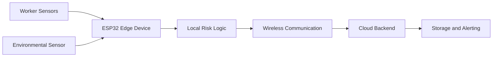

# Phase 1 Summary: Concept Design

## Overview

Phase 1 established the conceptual foundation of the FOURUT Worker Health and Safety Monitoring System. The phase defined the target safety problem, the initial system architecture, the planned hardware modules, the communication workflow, and the power-management approach required for a wearable edge-cloud monitoring prototype.

The work in this phase was design-oriented rather than deployment-oriented. Its purpose was to translate the problem statement into a feasible technical architecture that could later be implemented and validated through an embedded prototype and a cloud backend.

## Design Objective

The primary objective was to define a system capable of monitoring worker condition through a combination of biometric, motion, and environmental indicators. The proposed system needed to support continuous sensing at the edge, local risk detection, cloud-side record storage, and supervisor notification for high-risk events.

The design addressed five questions:

| Design Question | Phase 1 Response |
|---|---|
| What condition should the system monitor? | Worker health, fatigue, falls, and unsafe environmental exposure |
| Where should sensing occur? | On the wearable edge device and supporting environmental node |
| Where should classification occur? | Initially at the edge, with cloud-side verification and logging in later phases |
| How should data move through the system? | Sensor acquisition, edge processing, wireless communication, cloud ingestion, storage, and alerting |
| How should the prototype remain practical? | Use compact hardware, low-power operation, and clearly separated system responsibilities |

## System Concept

The proposed architecture followed a hybrid edge-cloud model. The edge layer was responsible for acquiring sensor data and detecting immediate safety events. The cloud layer was planned for centralized processing, storage, traceability, and supervisor notification.



This structure was selected because a worker-safety system must respond quickly while also preserving historical records for later analysis. Immediate detection is kept close to the worker, while cloud services provide persistence, centralized visibility, and scalable notification.

## Planned Functional Scope

Phase 1 defined the system around four major functions.

| Function | Description |
|---|---|
| Biometric monitoring | Track worker condition using heart-rate and oxygen-related indicators |
| Motion monitoring | Detect abnormal movement patterns and possible fall events |
| Environmental monitoring | Include air-quality information as part of the safety context |
| Cloud reporting | Forward structured data to a backend for storage, analysis, and notification |

The design separated these functions to make the later implementation easier to validate. Each function could be tested independently before full system integration.

## Hardware Planning

The hardware plan was organized into edge sensing, environmental sensing, communication, and power support.

| Module | Planned Role |
|---|---|
| ESP32-based edge gateway | Main embedded controller for worker telemetry, local processing, and wireless transmission |
| Biometric sensor interface | Provides physiological indicators such as heart rate and SpO2 |
| Motion sensor interface | Supports fall or abnormal-motion detection |
| Environmental sensor node | Adds air-quality data to the worker-safety context |
| Power subsystem | Provides stable portable power for field demonstration |
| Cloud backend | Receives, stores, and classifies transmitted worker records |

The design prioritized accessible components and a clear implementation path. This made the prototype suitable for academic development while leaving room for later improvements such as modular firmware, stronger power optimization, and multi-worker support.

## Communication Workflow

The planned communication model followed a structured pipeline from sensing to decision support.

```text
+-----------------------------+
|          Sensors            |
|-----------------------------|
| Heart rate, SpO2, motion,   |
| HRV, and environment data   |
+-------------+---------------+
              |
              v
+-----------------------------+
|      ESP32 Edge Device      |
|-----------------------------|
| Local preprocessing         |
| Risk evaluation             |
| Payload formatting          |
+-------------+---------------+
              |
              v
+-----------------------------+
|        Cloud Backend        |
|-----------------------------|
| Payload validation          |
| Event classification        |
| Backend processing          |
+-------------+---------------+
              |
      +-------+-------+
      |               |
      v               v
+-------------+   +------------------+
| Data Storage|   | Supervisor Alert |
|-------------|   |------------------|
| Event logs  |   | DANGER /         |
| History     |   | EMERGENCY only   |
+-------------+   +------------------+
```

The workflow was designed to support three message categories:

| Message Type | Purpose |
|---|---|
| Telemetry | Periodic monitoring data for health, motion, and environment |
| HRV or fatigue data | Worker fatigue and recovery-related indicators |
| Alert event | Warning, danger, fall, or emergency condition requiring attention |

This message separation was important because not all data has the same urgency. Normal telemetry is useful for monitoring and analysis, while alert events require faster processing and supervisor visibility.

## Initial Risk Model

Phase 1 defined the risk model as a four-level safety state. This model later became the basis for cloud-side validation and notification logic.

| Level | State | Interpretation |
|---:|---|---|
| 0 | NORMAL | No abnormal condition detected |
| 1 | WARNING | Early abnormal condition requiring monitoring |
| 2 | DANGER | Serious condition requiring supervisor attention |
| 3 | EMERGENCY | Critical condition requiring immediate response |

The model was intentionally simple and interpretable. A rule-based structure allowed the team to explain why a condition was classified as normal, warning, dangerous, or emergency. This was appropriate for an academic prototype where traceability and validation were important.

## Power-Management Planning

Power planning focused on stable operation during demonstration and safe embedded deployment. The design considered the following requirements:

| Requirement | Rationale |
|---|---|
| Stable supply voltage | Prevents unstable sensor readings and wireless failures |
| Low-power operation where possible | Extends runtime for wearable or portable use |
| Controlled wireless activity | Reduces unnecessary energy consumption |
| Clear separation of sensing intervals | Prevents constant high-load operation |
| Debug visibility during testing | Helps identify power-related failures early |

At this stage, power management was treated as a design requirement rather than a fully optimized implementation. Later phases could refine sleep modes, sampling intervals, and battery monitoring.

## Security and Privacy Planning

The concept design identified sensitive information that should not be exposed in source files or public repositories. This included Wi-Fi credentials, AWS endpoints, device certificates, private keys, and account-specific identifiers.

The planned security practice was based on three principles:

| Principle | Design Direction |
|---|---|
| Separate secrets from source code | Store credentials in local configuration files or environment variables |
| Minimize cloud permissions | Grant only the AWS permissions required by each function |
| Preserve traceability | Store records with timestamps, device identifiers, and classification results |

This security planning became important in later phases when AWS IoT, Lambda, DynamoDB, S3, and SNS were introduced.

## Design Deliverables

Phase 1 produced the following conceptual deliverables:

| Deliverable | Purpose |
|---|---|
| Problem definition | Establishes the worker-safety context and monitoring goals |
| System architecture | Defines the relationship between sensors, edge device, communication, and cloud backend |
| Hardware plan | Identifies the main components required for implementation |
| Communication workflow | Describes how data should move from the worker to the cloud |
| Risk-level model | Provides a consistent structure for safety classification |
| Power-management plan | Defines initial constraints for portable operation |
| Security considerations | Identifies sensitive values and responsible configuration practices |

## Phase Outcome

Phase 1 resulted in a feasible design for a worker health and safety monitoring prototype. The phase clarified the system boundaries, identified the required hardware and communication layers, and established a risk-classification model that could be implemented in later phases.

The main outcome was a structured blueprint for development. Phase 2 could then focus on building and validating a functional prototype rather than redefining the system architecture.

## Limitations at the End of Phase 1

| Limitation | Impact |
|---|---|
| No full firmware implementation yet | System behavior could not be validated with real embedded execution |
| No cloud pipeline deployed yet | Storage, alerting, and backend classification remained design goals |
| No integrated environmental node yet | Environmental sensing was planned but not fully incorporated |
| No field validation | Thresholds and workflows still required testing under prototype conditions |
| Power optimization not measured | Runtime and battery behavior required later evaluation |

## Transition to Phase 2

Phase 2 was planned as the implementation stage for the first functional prototype. The next phase needed to convert the architecture into working firmware, connect the edge device to the cloud backend, and validate the complete data path using representative normal, danger, and emergency events.
