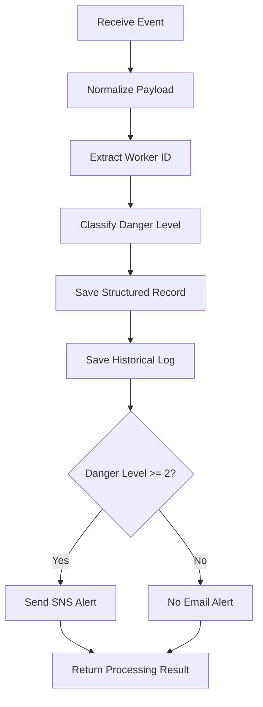
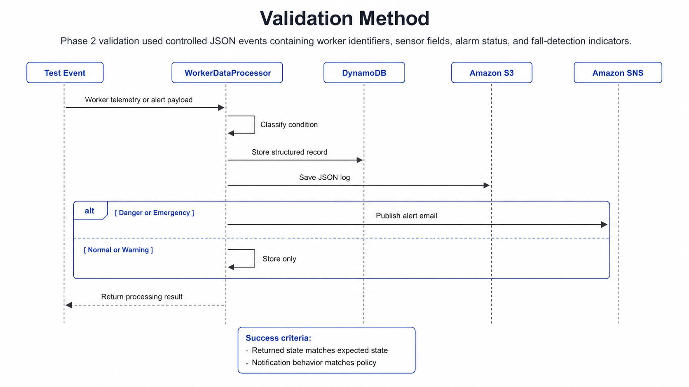

# Phase 2 Summary: Functional Prototype

## Overview

Phase 2 implemented and validated the first functional edge-cloud prototype of the FOURUT Worker Health and Safety Monitoring System. The conceptual architecture from Phase 1 was converted into a working pipeline in which edge-generated worker data could be transmitted to the cloud, classified, stored, and used for supervisor notification.

The phase focused on proving the main system path: sensor or test payload generation, cloud ingestion, worker-condition classification, persistent logging, and risk-based alerting.

## Implementation Objective

The objective of Phase 2 was to demonstrate that the core monitoring workflow could operate as an integrated prototype. Instead of remaining a design model, the system needed to process realistic worker-safety events and produce consistent cloud-side results.

The implementation target was:

```text
Worker payload
      ↓
AWS IoT Core
      ↓
Lambda processing
      ↓
DynamoDB / S3 storage
      ↓
SNS notification when required
```

This workflow established the first operational version of the edge-cloud safety pipeline.

## Prototype Scope

Phase 2 focused on the cloud-connected monitoring path. The prototype did not attempt to finalize every hardware feature or optimize the complete embedded system. Instead, it validated the most important safety behavior: whether worker data could be classified correctly and whether serious events could trigger supervisor notification.

| Area | Phase 2 Scope |
|---|---|
| Edge payload structure | Worker telemetry, HRV indicators, alarm status, and fall-detection fields |
| Cloud ingestion | AWS IoT Core message routing to Lambda |
| Processing logic | Rule-based worker-condition classification |
| Storage | Structured records and historical event logs |
| Notification | SNS alerting for danger and emergency states |
| Validation | Test events covering normal, danger, fall, and exhaustion cases |

## Edge-Cloud Architecture

The functional prototype followed the architecture below.

```text
[1] ESP32 Edge Device or Lambda Test Event
    ↓ JSON payload
[2] AWS IoT Core
    ↓ IoT Rule
[3] Lambda: WorkerDataProcessor
    ↓
[4] Cloud Outputs
    ├── DynamoDB record
    ├── S3 historical log
    └── SNS email alert
```

The key design decision was to keep message routing simple and place application logic inside the Lambda function. This separation made the cloud workflow easier to test: AWS IoT Core forwarded payloads, while Lambda handled parsing, classification, storage, and notification.

## Cloud Processing Workflow

The Lambda processing sequence was organized into a deterministic workflow.



This workflow ensured that all events could be stored for traceability while notification remained limited to conditions requiring supervisor attention.

## Classification Model

The prototype used a four-level classification model.

| Danger Level | State | Interpretation | Notification |
|---:|---|---|---|
| 0 | NORMAL | Worker condition is within safe limits | No |
| 1 | WARNING | Early abnormal condition detected | No email in current policy |
| 2 | DANGER | Serious risk requiring supervisor attention | Yes |
| 3 | EMERGENCY | Critical condition requiring immediate response | Yes |

The classifier prioritized emergency cases before danger and warning cases. This priority order prevented lower-severity conditions from masking critical events. For example, a fall event should remain an emergency even if other readings also match danger-level thresholds.

## Event Types Validated

Phase 2 validated representative events that covered the core safety states.

| Event Scenario | Expected State | Purpose |
|---|---|---|
| Normal worker condition | NORMAL | Confirms that safe data is stored without unnecessary email |
| Low SpO2 or danger alarm | DANGER | Confirms detection of serious physiological risk |
| Confirmed fall event | EMERGENCY | Confirms highest-priority emergency handling |
| Exhaustion-risk event | EMERGENCY | Confirms fatigue-related emergency classification |

These test cases were important because they checked both normal behavior and high-risk behavior. They also confirmed that the system could distinguish between storage-only events and notification-required events.

## Data Storage

The prototype used two storage paths.

| Storage Layer | Role |
|---|---|
| DynamoDB | Stores structured worker records with identifiers, timestamps, sensor fields, and classification results |
| Amazon S3 | Stores historical JSON logs containing the raw payload and processed classification |

This design provides two complementary forms of persistence. DynamoDB supports structured lookup and recent-state analysis, while S3 preserves a complete event history for review, debugging, and offline analysis.

## Notification Policy

SNS notification was configured as a risk-based action. The system sends an email only when the classified condition requires supervisor attention.

| Worker State | Email Sent |
|---|---|
| NORMAL | No |
| WARNING | No in the current prototype |
| DANGER | Yes |
| EMERGENCY | Yes |

This policy reduces unnecessary alerts while preserving urgent escalation for serious conditions.

## Validation Method

Phase 2 validation used controlled JSON events. Each event contained worker identifiers, sensor fields, alarm status, and fall-detection indicators. The expected Lambda result included the assigned danger level, state, storage result, and email-notification status.



A test was considered successful when the returned state matched the expected state and notification behavior matched the policy.

## Phase Deliverables

| Deliverable | Description |
|---|---|
| Functional cloud-processing pipeline | AWS IoT to Lambda workflow for worker payloads |
| Lambda classifier | Rule-based danger-level assignment |
| DynamoDB integration | Structured record storage |
| S3 logging | Historical JSON event retention |
| SNS notification | Email alerts for danger and emergency cases |
| Test event set | Normal, danger, fall, and exhaustion scenarios |
| Validation checklist | Expected outputs for storage and alert behavior |

## Phase Outcome

Phase 2 demonstrated that the core edge-cloud monitoring workflow was feasible. The system could accept worker-safety payloads, classify the condition, store the event, and send email notifications only for serious or critical conditions.

This phase provided the first validated implementation of the system logic. It also created a reusable cloud backend that could be extended in Phase 3 when the final edge firmware and environmental sensing node were integrated.

## Limitations at the End of Phase 2

| Limitation | Impact |
|---|---|
| Rule-based thresholds were fixed | Worker-specific calibration was not yet supported |
| Environmental sensing was not fully integrated | Air-quality data was present conceptually but not yet expanded through a dedicated node |
| Alert suppression was not implemented | Repeated high-risk events could generate repeated notifications |
| Schema validation was limited | Malformed payloads required stronger validation in later versions |
| Full embedded FreeRTOS integration was not final | The cloud pipeline was validated before the final edge gateway architecture |

## Transition to Phase 3

Phase 3 needed to integrate the functional cloud backend with the final embedded gateway and environmental sensing extension. The main goal was to move from a validated edge-cloud prototype to a more complete system that included FreeRTOS-based firmware, ESP-NOW environmental sensing, and end-to-end data integration.
