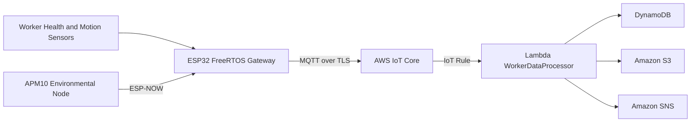
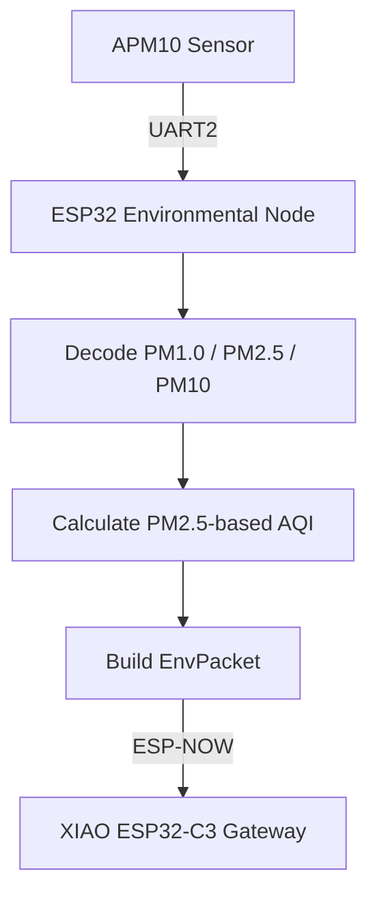

# Phase 3 Summary: Final Integrated System

## Overview

Phase 3 integrated the final edge-cloud system for the FOURUT Worker Health and Safety Monitoring System. The phase extended the functional prototype by introducing an AWS IoT-enabled FreeRTOS gateway, adding a dedicated ESP-NOW environmental sensing node, and reusing the validated Phase 2 cloud backend for classification, storage, and notification.

The final system combined local worker monitoring, environmental sensing, wireless node-to-gateway communication, MQTT transmission, cloud-side processing, and risk-based alerting.

## Integration Objective

The objective of Phase 3 was to consolidate the prototype into a complete system architecture. The phase focused on final edge-cloud integration and environmental sensing extension.

The main additions were:

| Addition | Role |
|---|---|
| AWS IoT-enabled FreeRTOS firmware | Runs on the ESP32 edge gateway and handles worker telemetry publication |
| ESP-NOW environmental sensing node | Reads particulate matter data and sends environmental packets to the gateway |
| APM10 PM sensor integration | Provides PM1.0, PM2.5, and PM10 readings for air-quality context |
| Optional MicroPython prototype update | Preserves an alternate lightweight implementation path |
| Reused Phase 2 cloud backend | Maintains the tested Lambda, DynamoDB, S3, and SNS pipeline |

## Final System Architecture



This architecture separates responsibility across the system. The environmental node only senses and transmits particulate-matter data. The gateway receives environmental data, combines it with worker telemetry, and publishes the integrated payload to AWS IoT Core. The cloud backend processes the payload, stores records, and sends notifications for high-risk states.

## Edge Gateway Role

The FreeRTOS-based gateway is the main embedded integration point. It coordinates worker-related sensing, receives environmental packets, manages connectivity, and publishes structured messages to the cloud.

| Gateway Responsibility | Description |
|---|---|
| Worker telemetry processing | Handles biometric, motion, HRV, and alarm-related values |
| Environmental data reception | Receives PM and AQI data from the ESP-NOW node |
| Task separation | Uses FreeRTOS tasks to separate sensing, communication, and monitoring responsibilities |
| AWS IoT communication | Publishes telemetry, HRV, and alert messages through MQTT over TLS |
| Safety-state reporting | Sends alarm level, fall status, and sensor values in structured payloads |

The gateway acts as the bridge between local sensing and the cloud-processing pipeline.

## Environmental Node Role

The environmental node extends the system with local air-quality sensing. It uses an ESP32S NodeMCU or ESP32 DevKit board with an APM10 UART particulate-matter sensor.



The node does not connect directly to AWS IoT Core. Its responsibility is limited to local environmental sensing and ESP-NOW transmission. This keeps the node lightweight and allows the gateway to remain the single cloud-connected device.

## Environmental Packet Design

The environmental packet is designed to be compact and gateway-compatible.

| Field | Purpose |
|---|---|
| `magic` | Packet identifier used for validation |
| `version` | Packet format version |
| `node_id` | Environmental node identifier |
| `seq` | Incrementing packet sequence number |
| `pm1_0` | PM1.0 concentration |
| `pm2_5` | PM2.5 concentration |
| `pm10` | PM10 concentration |
| `aqi` | AQI value derived from PM2.5 for prototype visualization |
| `battery_mv` | Battery voltage placeholder |
| `uptime_ms` | Node uptime at transmission |

The gateway and environmental node must use the same packet structure, field order, data types, and ESP-NOW channel. Any mismatch can cause incorrect readings at the gateway.

## Cloud Backend Reuse

Phase 3 reused the Phase 2 AWS backend. This reduced architectural risk because the main cloud-processing path had already been validated.


The cloud backend continued to perform the same core operations: payload parsing, condition classification, DynamoDB storage, S3 logging, and SNS notification for danger or emergency events.

## MQTT Message Organization

The gateway publishes data under a worker-specific namespace.

| Topic | Purpose |
|---|---|
| `worker/W001/telemetry` | Periodic integrated worker and environment telemetry |
| `worker/W001/hrv` | HRV and fatigue-related summaries |
| `worker/W001/alert` | Warning, danger, fall, or emergency events |

This topic structure keeps regular telemetry, fatigue data, and alert events separated while maintaining a consistent worker namespace.

## Final Data Flow

```text
1. Worker sensors and local logic produce health, motion, and alarm data.
2. The APM10 environmental node reads PM values through UART.
3. The environmental node calculates an AQI value and sends an ESP-NOW packet.
4. The gateway receives environmental data and combines it with worker telemetry.
5. The gateway publishes structured MQTT payloads to AWS IoT Core.
6. AWS IoT Core routes matching messages to the Lambda processor.
7. Lambda classifies the worker state as NORMAL, WARNING, DANGER, or EMERGENCY.
8. Processed records are stored in DynamoDB and historical logs are saved to S3.
9. SNS email is sent when the state is DANGER or EMERGENCY.
```

## Validation Focus

Phase 3 validation focused on end-to-end integration rather than isolated component behavior.

| Validation Area | Expected Result |
|---|---|
| Environmental sensor reading | PM1.0, PM2.5, and PM10 values are decoded from the APM10 frame |
| ESP-NOW transmission | Environmental packets are queued, delivered, and received by the gateway |
| Gateway integration | Environmental values appear in the integrated telemetry payload |
| AWS IoT connection | Gateway publishes MQTT messages over TLS |
| Lambda processing | Worker condition is classified correctly |
| Storage behavior | Processed events are stored in DynamoDB and S3 |
| Alert behavior | SNS email is sent only for danger or emergency states |

## Phase Deliverables

| Deliverable | Description |
|---|---|
| FreeRTOS edge gateway firmware | Final gateway firmware for sensing, task management, ESP-NOW reception, and MQTT publication |
| ESP-NOW environmental node firmware | APM10-based particulate-matter sensing and wireless packet transmission |
| Updated cloud configuration | AWS IoT topic structure, IoT Rule, Lambda environment variables, storage, and notification references |
| Reused Lambda backend | Validated cloud-side classifier and storage/alert pipeline |
| Validation documentation | Expected behavior for telemetry, HRV, alert, environmental data, and cloud responses |
| Security cleanup | Separation of credentials, certificates, and account-specific values from public source files |

## Phase Outcome

Phase 3 produced the final integrated prototype. The system could collect worker and environmental information at the edge, forward data through MQTT, process safety states in the cloud, store records, and issue supervisor alerts for high-risk conditions.

The major improvement over Phase 2 was the expansion from a functional cloud-connected prototype to a more complete edge-cloud system with environmental sensing and FreeRTOS-based gateway organization.

## Current Limitations

| Limitation | Impact |
|---|---|
| Classification remains rule-based | The system is interpretable but not adaptive to individual worker profiles |
| Environmental AQI is prototype-oriented | Final deployment should align the AQI method with the selected regional standard |
| ESP-NOW encryption is not yet enabled | Local wireless packets are not protected against passive observation |
| Battery reporting is incomplete on the environmental node | Power-state monitoring remains limited |
| Alert cooldown is not implemented | Repeated danger events may produce repeated notifications |
| Multi-worker scaling requires additional configuration | Worker IDs, topics, and thresholds need systematic management for larger deployments |

## Recommended Future Work

The next development stage should focus on robustness, scalability, and deployment readiness.

| Improvement | Purpose |
|---|---|
| Configurable thresholds | Support worker-specific or environment-specific safety limits |
| Alert cooldown logic | Reduce repeated notifications for the same sustained event |
| ESP-NOW encryption | Improve local wireless communication security |
| Battery measurement | Add meaningful power telemetry for environmental nodes |
| Schema validation | Reject malformed MQTT payloads before processing |
| Structured logging and metrics | Improve debugging and operational monitoring |
| Multi-node support | Extend the system to multiple workers and environmental nodes |

## Conclusion

Phase 3 completed the main technical integration of the FOURUT prototype. The final system linked wearable worker monitoring, particulate-matter sensing, ESP-NOW communication, AWS IoT messaging, Lambda classification, cloud storage, and SNS alerting into a single end-to-end workflow.

The resulting architecture is suitable for academic demonstration and competition evaluation. It provides a clear basis for future improvements in reliability, security, scalability, and field validation.
